## 問題描述
使用 `Intrusion Detection Evaluation Dataset (CIC-IDS2017)` 數據集進行 DDoS 與深度學習應用，希望能透過深度學習來決策流量是否為惡意。

##  數據摘要

### Total Fwd Packets
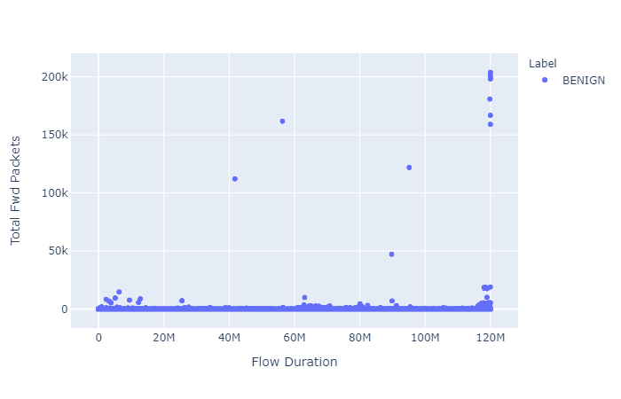

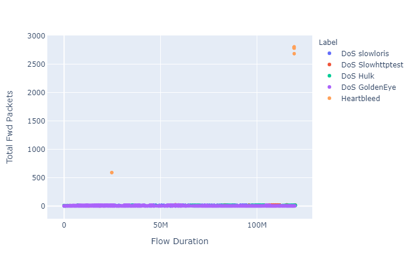

從這個指標"來源到目的地傳遞封包數量"可以看出，此特徵流量非常相近，無法有效辨別。

### Total Fwd Packets and Total Backward Packets
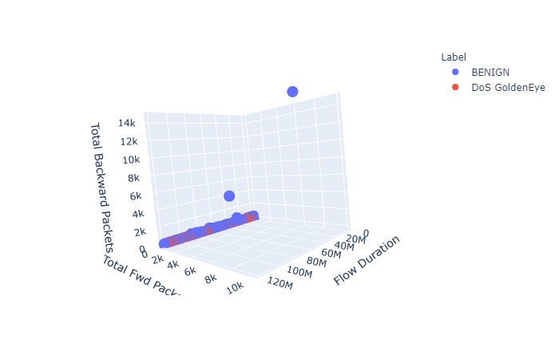

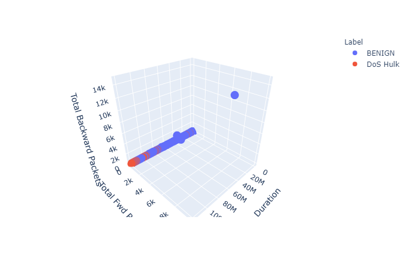
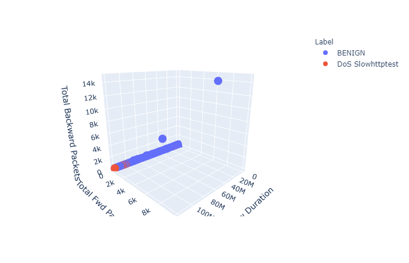
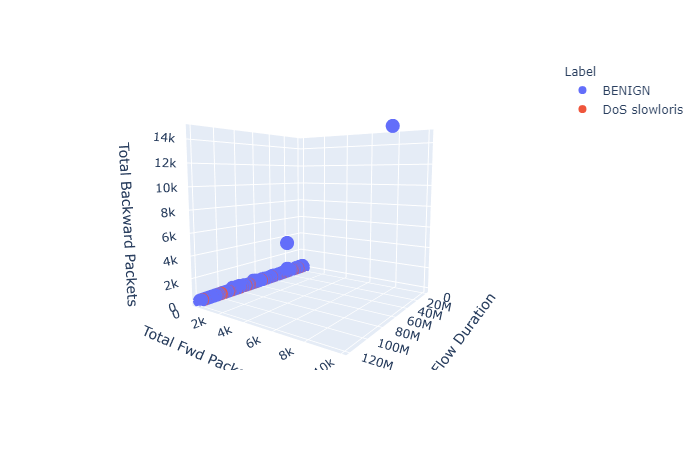
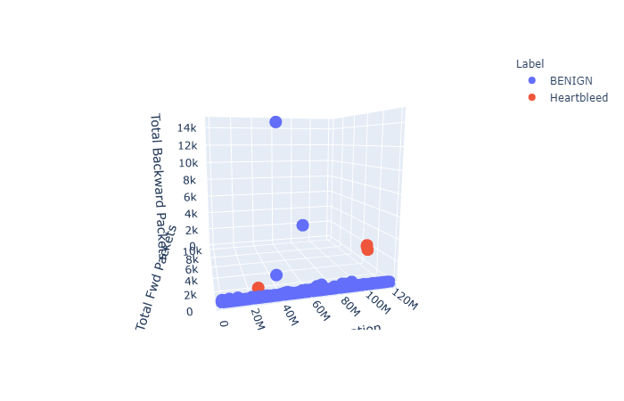

從以上圖來看，正常流量和每種攻擊近乎都是重疊。

### Total Length of Bwd packets and Total Length of Fwd packets

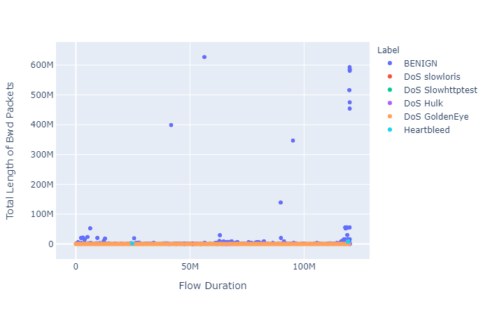
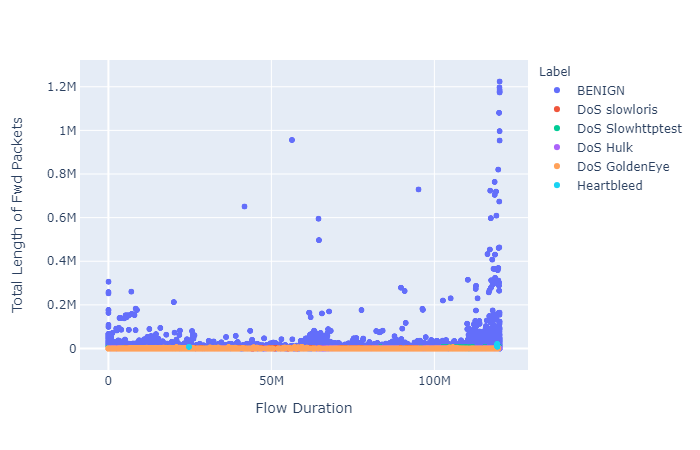

從 `Total-Length-of-Fwd-Packets` 特徵來看，有比較明顯的知道攻擊流量的"從來源到目的地傳遞封包的總大小大致上會比正常流量要來的小，但是還是有重疊部分。
### Flow Bytes/s and Flow Packets/s
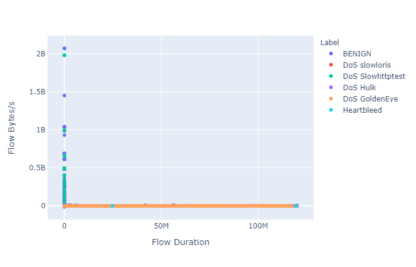
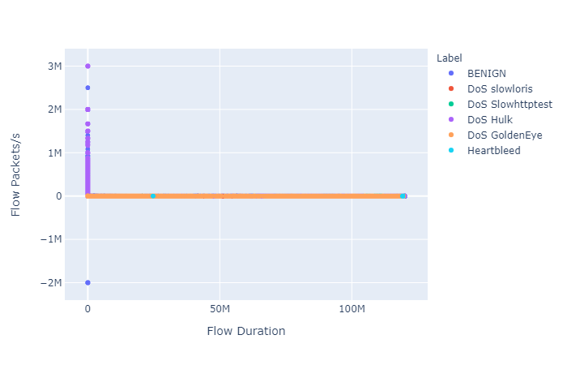


### 特徵不同值計數

```python
Destination Port                30094
Flow Duration                  363185
Total Fwd Packets                 685
Total Backward Packets            859
Total Length of Fwd Packets      9380
Total Length of Bwd Packets     23483
Fwd Packet Length Max            3728
Fwd Packet Length Min             220
Fwd Packet Length Mean          31471
Fwd Packet Length Std           63498
Bwd Packet Length Max            3836
Bwd Packet Length Min             429
Bwd Packet Length Mean          41095
Bwd Packet Length Std           55643
Flow Bytes/s                   450841
Flow Packets/s                 387031
Flow IAT Mean                  370810
Flow IAT Std                   222370
Flow IAT Max                   148528
Flow IAT Min                    47743
Fwd IAT Total                  100832
Fwd IAT Mean                   162817
Fwd IAT Std                    142925
Fwd IAT Max                     98682
Fwd IAT Min                     37400
Bwd IAT Total                  111743
Bwd IAT Mean                   181207
Bwd IAT Std                    211343
Bwd IAT Max                    105600
Bwd IAT Min                     18812
Fwd PSH Flags                       2
Bwd PSH Flags                       1
Fwd URG Flags                       1
Bwd URG Flags                       1
Fwd Header Length                1746
Bwd Header Length                1910
Fwd Packets/s                  382443
Bwd Packets/s                  358777
Min Packet Length                 166
Max Packet Length                4469
Packet Length Mean              61803
Packet Length Std              135696
Packet Length Variance         133816
FIN Flag Count                      2
SYN Flag Count                      2
RST Flag Count                      2
PSH Flag Count                      2
ACK Flag Count                      2
URG Flag Count                      2
CWE Flag Count                      1
ECE Flag Count                      2
Down/Up Ratio                      17
Average Packet Size             60919
Avg Fwd Segment Size            31471
Avg Bwd Segment Size            41095
Fwd Header Length.1              1746
Fwd Avg Bytes/Bulk                  1
Fwd Avg Packets/Bulk                1
Fwd Avg Bulk Rate                   1
Bwd Avg Bytes/Bulk                  1
Bwd Avg Packets/Bulk                1
Bwd Avg Bulk Rate                   1
Subflow Fwd Packets               685
Subflow Fwd Bytes                9380
Subflow Bwd Packets               859
Subflow Bwd Bytes               23486
Init_Win_bytes_forward           5698
Init_Win_bytes_backward          6049
act_data_pkt_fwd                  564
min_seg_size_forward               13
Active Mean                     78864
Active Std                      44220
Active Max                      76777
Active Min                      53325
Idle Mean                       37601
Idle Std                        41528
Idle Max                        21986
Idle Min                        43869
Label                               6
dtype: int64
```

發現說其實有很多的特徵擁有的值都是固定一個這其實對於學習的幫助不是很大，在做決策時此特徵不管什麼條件都成立。因此在做特徵處理時也會將其特徵欄位刪除。

透過以下程式也觀察數據中是否有缺失值
```python
def miss_values_rate(dataframe):
    missing_values_count = dataframe.isnull().sum()
    total_miss_values = missing_values_count.sum()
    total_cells = np.product(dataframe.shape)
    print(total_miss_values)
    print(total_cells)
    print((total_miss_values/total_cells) * 100) 
```
結果是

```
1008 # 總缺失值
54723537 # 總樣本數
0.0018419862005630227 # 缺失比率
```

缺失值處理有
- quadratic
- fill
- 等方式

這邊可參考此[筆記](data-preprocessing/README.md)，當中也有嘗試做特徵選取的處裡，針對以下方式選取特徵

- RFE 特徵選取
- SelectKBest 特徵選取
- SelectPercentile 特徵選取

結果可至[這邊](feature_selection)

對深度學習來說就是要嘗試不同可能，我們有針對缺失值處理和特徵選取等做實驗比較。

## 測試

這邊嘗試架構了許多神經網路，並進行調整與比較。網路構建可到此[目錄](utils/network)。在此[目錄](model_record/)記錄了每次訓練的結果資料，最後選擇了一個好的架構。預測不同攻擊的結果可至[這邊](model_record/README.md)。

這邊我們使用基本的 Recall、Precision、loss 等進行決策，對我們來說 Recall 越高越好，其表示預測攻擊的能力越好，但是目前的Precision 無法到很好，頂多是 0.96 左右，其對正常流量會有些許影響，這邊還要再去想想看。


有一些操作被 GPU 限制，對於 BILSTM 取得 weight 目前無法從 GPU 取出，這不知道是否是 Bug 待釐清。

