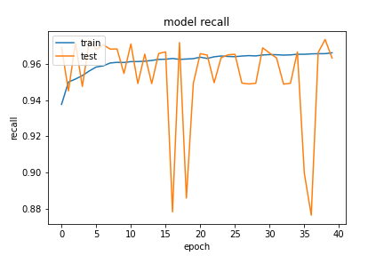

## Network Arch
```python
        self.forward_layer_one = layers.LSTM(64, dropout=0.5, return_sequences=True) # kernel_regularizer=tf.keras.regularizers.l2(10e-06)
        self.backward_layer_one = layers.LSTM(64, dropout=0.5, return_sequences=True , go_backwards=True) # kernel_regularizer=tf.keras.regularizers.l2(10e-06)
        self.bi_one = layers.Bidirectional(self.forward_layer_one, backward_layer=self.backward_layer_one, name='bi_one')

        self.drop_one = layers.BatchNormalization()

        self.forward_layer_two = layers.LSTM(32, kernel_regularizer=tf.keras.regularizers.l2(10e-06), dropout=0.5 , return_sequences=True)
        self.backward_layer_two = layers.LSTM(32, kernel_regularizer=tf.keras.regularizers.l2(10e-06), dropout=0.5, return_sequences=True, go_backwards=True)
        self.bi_two = layers.Bidirectional(self.forward_layer_two, backward_layer=self.backward_layer_two, name='bi_two')

        self.drop_two = layers.BatchNormalization()

        self.forward_layer_three = layers.LSTM(16, kernel_regularizer=tf.keras.regularizers.l2(10e-06), dropout=0.5)
        self.backward_layer_three = layers.LSTM(16, kernel_regularizer=tf.keras.regularizers.l2(10e-06), dropout=0.5, go_backwards=True)
        self.bi_three = layers.Bidirectional(self.forward_layer_three, backward_layer=self.backward_layer_three, name='bi_three')

        self.drop_three = layers.BatchNormalization()

        self.flatten_one = layers.Flatten()

        self.dense_four = layers.Dense(16, kernel_regularizer=tf.keras.regularizers.l2(1e-01), activity_regularizer=tf.keras.regularizers.l1(1e-03) ,name='dense_three')
        self.avtivation_four = layers.Activation(tf.nn.relu6, name='dense_four_activation')

        self.drop_four = layers.BatchNormalization()

        self.dense = layers.Dense(2, name='classification') # , kernel_regularizer=tf.keras.regularizers.l2(1e-01), activity_regularizer=tf.keras.regularizers.l1(1e-03)
        self.output_res = layers.Activation(tf.nn.softmax, name='classifi')
```

### 20200922-233447-network-RMSprop

與 20200922-223957-network-RMSprop 網路架構相同，這邊使用了 `clipnorm` 方式來正規化 loss。

- Optimizer
    - learning_rate=0.001
    - momentum=0.9
    - decay= 1e-06
    - clipnorm=0.9
- epochs=40
- batch_size=512
- validation_split=0.3

##### 評估
以評估來看改善了 loss，結果有比較好。

```
loss :  0.1291859745979309
tp :  200044.0
fp :  7767.0
tn :  200044.0
fn :  7767.0
acc :  0.0
precision :  0.9626246690750122
recall :  0.9626246690750122
auc :  0.9956253170967102
binary_accuracy :  0.9626246690750122
binary_crossentropy :  0.12034416943788528
```

##### 預測
```
TrueNegatives result:  126963.0
TruePositives result:  73081.0
FalseNegatives result:  3142.0
FalsePositives result:  4625.0
Recall result:  0.95877886
Precision result:  0.94048077
```

##### 圖片



