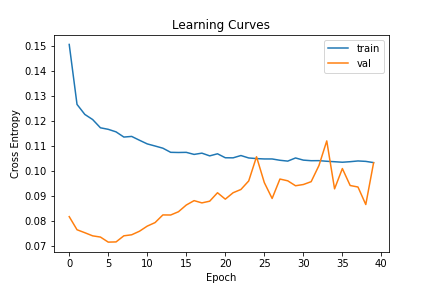
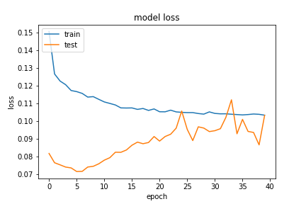
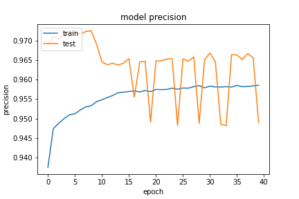

## Network Arch
```python
        self.forward_layer_one = layers.LSTM(32, kernel_constraint=tf.keras.constraints.MaxNorm(max_value=4) , recurrent_constraint=tf.keras.constraints.MaxNorm(max_value=4), dropout=0.5, return_sequences=True) # kernel_regularizer=tf.keras.regularizers.l2(10e-06)
        self.backward_layer_one = layers.LSTM(32, kernel_constraint=tf.keras.constraints.MaxNorm(max_value=4) , recurrent_constraint=tf.keras.constraints.MaxNorm(max_value=4), dropout=0.5, return_sequences=True , go_backwards=True) # kernel_regularizer=tf.keras.regularizers.l2(10e-06)
        self.bi_one = layers.Bidirectional(self.forward_layer_one, backward_layer=self.backward_layer_one, name='bi_one')

        self.drop_one = layers.GaussianDropout(0.5)

        self.forward_layer_two = layers.LSTM(16)
        self.backward_layer_two = layers.LSTM(16, go_backwards=True)
        self.bi_two = layers.Bidirectional(self.forward_layer_two, backward_layer=self.backward_layer_two, name='bi_two')

        self.drop_two = layers.GaussianDropout(0.5)

        # self.forward_layer_three = layers.LSTM(16,)
        # self.backward_layer_three = layers.LSTM(16, go_backwards=True)
        # self.bi_three = layers.Bidirectional(self.forward_layer_three, backward_layer=self.backward_layer_three, name='bi_three')

        # self.drop_three = layers.GaussianDropout(0.5)

        self.flatten_one = layers.Flatten()

        self.dense_four = layers.Dense(16, name='dense_three')
        self.avtivation_four = layers.Activation(tf.nn.relu6, name='dense_four_activation')

        # self.drop_four = layers.GaussianDropout(0.5)

        self.dense = layers.Dense(2, name='classification') # , kernel_regularizer=tf.keras.regularizers.l2(1e-01), activity_regularizer=tf.keras.regularizers.l1(1e-03)
        self.output_res = layers.Activation(tf.nn.softmax, name='classifi')
```

### 20200923-151828-network-RMSprop

減少層數，並拿掉兩個 `GaussianDropout`。

- Optimizer
    - learning_rate=0.001
    - momentum=0.9
    - decay= 1e-06
    - clipnorm=0.9
- epochs=40
- batch_size=512
- validation_split=0.3

##### 評估
以評估來看 loss 不錯，但感覺在驗證集的 loss 還是有點升高。

```
loss :  0.10290833562612534
tp :  197133.0
fp :  10678.0
tn :  197133.0
fn :  10678.0
acc :  0.0
precision :  0.9486167430877686
recall :  0.9486167430877686
auc :  0.9935803413391113
binary_accuracy :  0.9486167430877686
binary_crossentropy :  0.10290833562612534
```

##### 預測
```
TrueNegatives result:  130815.0
TruePositives result:  66318.0
FalseNegatives result:  9415.0
FalsePositives result:  1263.0
Recall result:  0.8756817
Precision result:  0.9813113
```

##### 圖片




