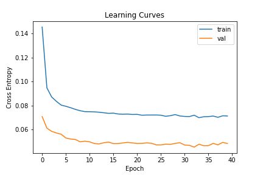
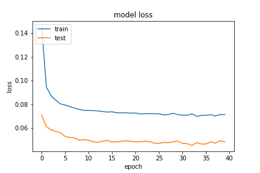
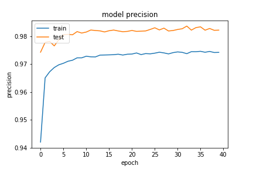
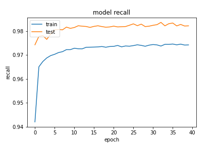

## Network Arch
```python
        self.forward_layer_one = layers.LSTM(64, kernel_constraint=tf.keras.constraints.MaxNorm(max_value=4) , recurrent_constraint=tf.keras.constraints.MaxNorm(max_value=4), return_sequences=True) # kernel_regularizer=tf.keras.regularizers.l2(10e-06)
        self.backward_layer_one = layers.LSTM(64, kernel_constraint=tf.keras.constraints.MaxNorm(max_value=4) , recurrent_constraint=tf.keras.constraints.MaxNorm(max_value=4), return_sequences=True , go_backwards=True) # kernel_regularizer=tf.keras.regularizers.l2(10e-06)
        self.bi_one = layers.Bidirectional(self.forward_layer_one, backward_layer=self.backward_layer_one, name='bi_one')

        self.noise_one = layers.GaussianNoise(0.5)

        self.drop_one = layers.GaussianDropout(0.5)

        self.forward_layer_two = layers.LSTM(32, return_sequences=True)
        self.backward_layer_two = layers.LSTM(32, return_sequences=True, go_backwards=True)
        self.bi_two = layers.Bidirectional(self.forward_layer_two, backward_layer=self.backward_layer_two, name='bi_two')

        self.drop_two = layers.GaussianDropout(0.5)

        self.forward_layer_three = layers.LSTM(16,)
        self.backward_layer_three = layers.LSTM(16, go_backwards=True)
        self.bi_three = layers.Bidirectional(self.forward_layer_three, backward_layer=self.backward_layer_three, name='bi_three')

        self.drop_three = layers.GaussianDropout(0.5)

        self.flatten_one = layers.Flatten()

        self.dense_four = layers.Dense(16, name='dense_three')
        self.noise_two = layers.GaussianNoise(0.2)
        self.avtivation_four = layers.Activation(tf.nn.relu6, name='dense_four_activation')

        self.drop_four = layers.GaussianDropout(0.5)

        self.dense = layers.Dense(2, name='classification') # , kernel_regularizer=tf.keras.regularizers.l2(1e-01), activity_regularizer=tf.keras.regularizers.l1(1e-03)
        self.output_res = layers.Activation(tf.nn.softmax, name='classifi')
```

### 20200923-162245-network-RMSprop

這次使用基於 `20200923-104825-network-RMSprop` 的架構改進，同樣的第一層 BI-LSTM 有增加 `constraint` 進行數據的正規化，並增加 `GaussianNoise` 提高模型能力。

- Optimizer
    - learning_rate=0.001
    - momentum=0.9
    - decay= 1e-06
    - clipnorm=0.9
- epochs=40
- batch_size=512
- validation_split=0.3

##### 評估
以評估來看 loss 不錯，但感覺在驗證集的 loss 還是有點升高。

```
loss :  0.047259822487831116
tp :  204210.0
fp :  3601.0
tn :  204210.0
fn :  3601.0
acc :  0.12219276279211044
precision :  0.9826717376708984
recall :  0.9826717376708984
auc :  0.9985670447349548
binary_accuracy :  0.9826717376708984
binary_crossentropy :  0.047259822487831116
```

##### 預測
還可以在改進模型，相較於 `20200923-104825-network-RMSprop` 的網路還差一點。
```
TrueNegatives result:  128550.0
TruePositives result:  75660.0
FalseNegatives result:  216.0
FalsePositives result:  3385.0
Recall result:  0.9971532
Precision result:  0.95717627
```

##### 圖片


 20200923-104825-network-RMSprop 的 loss


