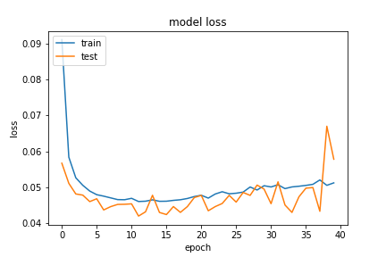

## Network Arch
```python
        self.forward_layer_one = layers.LSTM(64, kernel_constraint=tf.keras.constraints.MaxNorm(max_value=4) , recurrent_constraint=tf.keras.constraints.MaxNorm(max_value=4), return_sequences=True) # kernel_regularizer=tf.keras.regularizers.l2(10e-06)
        self.backward_layer_one = layers.LSTM(64, kernel_constraint=tf.keras.constraints.MaxNorm(max_value=4) , recurrent_constraint=tf.keras.constraints.MaxNorm(max_value=4), return_sequences=True , go_backwards=True) # kernel_regularizer=tf.keras.regularizers.l2(10e-06)
        self.bi_one = layers.Bidirectional(self.forward_layer_one, backward_layer=self.backward_layer_one, name='bi_one')

        self.noise_one = layers.GaussianNoise(0.5)

        self.drop_one = layers.BatchNormalization()

        self.forward_layer_two = layers.LSTM(32, return_sequences=True)
        self.backward_layer_two = layers.LSTM(32, return_sequences=True, go_backwards=True)
        self.bi_two = layers.Bidirectional(self.forward_layer_two, backward_layer=self.backward_layer_two, name='bi_two')

        self.drop_two = layers.BatchNormalization()

        self.forward_layer_three = layers.LSTM(16,)
        self.backward_layer_three = layers.LSTM(16, go_backwards=True)
        self.bi_three = layers.Bidirectional(self.forward_layer_three, backward_layer=self.backward_layer_three, name='bi_three')

        self.drop_three = layers.BatchNormalization()

        self.flatten_one = layers.Flatten()

        self.dense_four = layers.Dense(16, kernel_constraint=tf.keras.constraints.MaxNorm(max_value=4), name='dense_three')
        self.noise_two = layers.GaussianNoise(0.5)
        self.avtivation_four = layers.Activation(tf.nn.relu6, name='dense_four_activation')

        self.drop_four = layers.BatchNormalization()

        self.dense = layers.Dense(2, name='classification') # , kernel_regularizer=tf.keras.regularizers.l2(1e-01), activity_regularizer=tf.keras.regularizers.l1(1e-03)
        self.output_res = layers.Activation(tf.nn.softmax, name='classifi')
```

### 20200923-181126-network-RMSprop

這次使用基於 `20200923-174819-network-RMSprop` 的架構改進，在 `dense_four` 有增加 `constraint` 進行數據的正規化，`noise_two` 從 0.2 提升至 0.5。

- Optimizer
    - learning_rate=0.001
    - momentum=0.9
    - decay= 1e-06
    - clipnorm=0.9
- epochs=40
- batch_size=512
- validation_split=0.3

##### 評估
以評估來看 loss 不錯，驗證集的 loss 沒有升高的傾向。

```
loss :  0.042246077209711075
tp :  204753.0
fp :  3058.0
tn :  204753.0
fn :  3058.0
acc :  0.0
precision :  0.985284686088562
recall :  0.985284686088562
auc :  0.998802661895752
binary_accuracy :  0.985284686088562
binary_crossentropy :  0.042246077209711075
```

##### 預測
還可以在改進模型，Precision 部分有提升，但希望能到接近 0.99。
```

y_pred = net.predict(X_test)
y_class = np.argmax(y_pred, axis=1)
y_label = np.argmax(y_test, axis=1)
modelmetric.confusion_matrix(y_label, y_class)
modelmetric.eva_metric(y_label, y_class)
TrueNegatives result:  129056.0
TruePositives result:  75697.0
FalseNegatives result:  186.0
FalsePositives result:  2872.0
Recall result:  0.9975489
Precision result:  0.96344614
```

##### 圖片


 20200923-174819-network-RMSprop 的 loss


