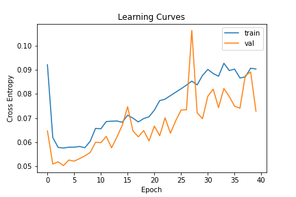
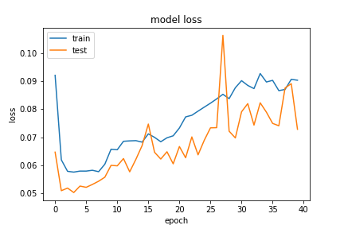
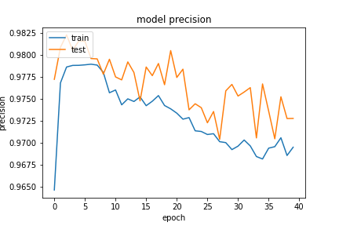
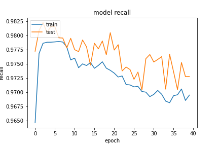

## Network Arch
```python
        self.forward_layer_one = layers.LSTM(64, kernel_constraint=tf.keras.constraints.MaxNorm(max_value=4), recurrent_constraint=tf.keras.constraints.MaxNorm(
            max_value=4), bias_regularizer=tf.keras.regularizers.l2(10e-06) ,return_sequences=True)
        self.backward_layer_one = layers.LSTM(64, kernel_constraint=tf.keras.constraints.MaxNorm(max_value=4), recurrent_constraint=tf.keras.constraints.MaxNorm(
            max_value=4), return_sequences=True, go_backwards=True)
        self.bi_one = layers.Bidirectional(
            self.forward_layer_one, backward_layer=self.backward_layer_one, name='bi_one')

        self.noise_one = layers.GaussianNoise(0.5)

        self.bn_one = layers.BatchNormalization()

        self.forward_layer_two = layers.LSTM(32, return_sequences=True)
        self.backward_layer_two = layers.LSTM(
            32, return_sequences=True, go_backwards=True)
        self.bi_two = layers.Bidirectional(
            self.forward_layer_two, backward_layer=self.backward_layer_two, name='bi_two')

        self.bn_two = layers.BatchNormalization()

        self.forward_layer_three = layers.LSTM(16,)
        self.backward_layer_three = layers.LSTM(16, go_backwards=True)
        self.bi_three = layers.Bidirectional(
            self.forward_layer_three, backward_layer=self.backward_layer_three, name='bi_three')

        self.bn_three = layers.BatchNormalization()

        self.flatten_one = layers.Flatten()

        self.dense_four = layers.Dense(
            16, kernel_constraint=tf.keras.constraints.MaxNorm(max_value=4), bias_regularizer=tf.keras.regularizers.l2(1e-02), name='dense_three')
        self.noise_two = layers.GaussianNoise(0.5)
        self.avtivation_four = layers.Activation(
            tf.nn.relu6, name='dense_four_activation')

        self.bn_four = layers.BatchNormalization()

        self.dense = layers.Dense(2, name='classification')
        self.output_res = layers.Activation(tf.nn.softmax, name='classifi')

```

### 20200924-140551-network-RMSprop

這次使用基於 `20200923-181126-network-RMSprop` 的架構，新增 `bias_regularizer` 約束
- Optimizer
    - learning_rate=0.001
    - momentum=0.95
    - decay= 1e-06
    - clipnorm=0.9
- epochs=40
- batch_size=512
- validation_split=0.3

##### 評估
loss 慢慢升高，有可能是新增的 `bias_regularizer` 有所影響。

```
loss :  0.0720677301287651
tp :  202197.0
fp :  5614.0
tn :  202197.0
fn :  5614.0
acc :  0.0
precision :  0.9729850888252258
recall :  0.9729850888252258
auc :  0.9961875081062317
binary_accuracy :  0.9729850888252258
binary_crossentropy :  0.07194998115301132
```

##### 預測

```
TrueNegatives result:  127734.0
TruePositives result:  74463.0
FalseNegatives result:  1135.0
FalsePositives result:  4479.0
Recall result:  0.98498636
Precision result:  0.94326216
```

##### 圖片




