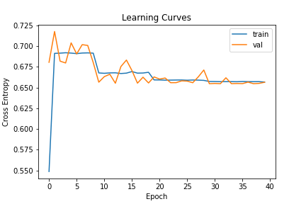
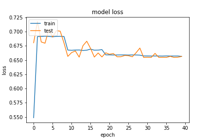
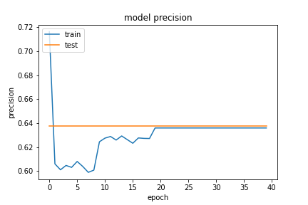
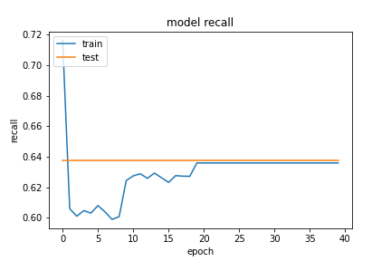

特徵部份把欄位只有一個值得欄位刪除。實作在 `data_value` 的 `column_del_one_value` 方法中。
```python
from tensorflow.keras import layers, Input
from tensorflow.keras import Model
dos_input = Input(shape=(X_train.shape[1],))

dense = layers.Dense(256, name='nn1')(dos_input)
activation = layers.Activation(tf.nn.relu6, name='nn1_relu6')(dense)
dense = layers.Dense(128, name='nn2')(activation)
activation = layers.Activation(tf.nn.relu6, name='nn2_relu6')(dense)
dense = layers.Dense(64, name='nn3')(activation)
activation = layers.Activation(tf.nn.relu6, name='nn3_relu6')(dense)
dense = layers.Dense(32, name='nn4')(activation)
activation = layers.Activation(tf.nn.relu6, name='nn4_relu6')(dense)
dense = layers.Dense(16, name='nn5')(activation)
activation = layers.Activation(tf.nn.relu6, name='nn5_relu6')(dense)
dense = layers.Dense(8, name='nn6')(activation)
activation = layers.Activation(tf.nn.relu6, name='nn6_relu6')(dense)
dense = layers.Dense(2, name='nn7')(activation)
output = layers.Activation(tf.nn.softmax, name='output')(dense)

model = Model(inputs=dos_input, outputs=output)
algorithm = tf.keras.optimizers.SGD(learning_rate=0.01, momentum=0.99, clipvalue=0.2, nesterov=True, name='SGD')

model.compile(optimizer=algorithm, loss='binary_crossentropy', metrics=modelmetric.metric('binary_crossentropy'))
```

- epoch=40
- batchsize=512

## evaluate
```
loss :  0.6587149500846863
tp :  131612.0
fp :  75810.0
tn :  131612.0
fn :  75810.0
acc :  0.0
precision :  0.6345131993293762
recall :  0.6345131993293762
auc :  0.6345131993293762
binary_accuracy :  0.6345131993293762
binary_crossentropy :  0.6587149500846863
```

## predict
```
TrueNegatives result:  131612.0
TruePositives result:  0.0
FalseNegatives result:  75810.0
FalsePositives result:  0.0
Recall result:  0.0
Precision result:  0.0
```

## fig




