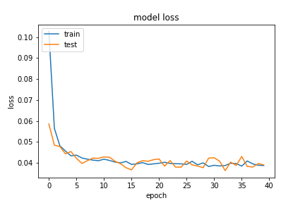
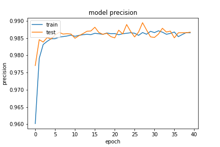
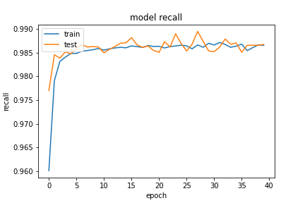

數據前處裡使用，特徵部份把欄位只有一個值得欄位刪除。實作在 `data_value` 的 `column_del_one_value` 方法中。

```python
from tensorflow.keras import layers, Input, constraints
from tensorflow.keras import Model
dos_input = Input(shape=(X_train.shape[1],))

dense = layers.Dense(256, name='nn1', kernel_constraint=constraints.MaxNorm(max_value=4))(dos_input)
activation = layers.Activation(tf.nn.relu, name='nn1_relu')(dense)
dense = layers.Dense(128, name='nn2')(activation)
drop = layers.GaussianDropout(0.5)(dense)
activation = layers.Activation(tf.nn.relu, name='nn2_relu')(dense)
dense = layers.Dense(64, name='nn3')(drop)
noise = layers.GaussianNoise(0.5)(dense)
activation = layers.Activation(tf.nn.relu, name='nn3_relu')(dense)
dense = layers.Dense(32, name='nn4')(noise)
noise = layers.GaussianNoise(0.2)(dense)
activation = layers.Activation(tf.nn.relu, name='nn4_relu')(dense)
dense = layers.Dense(16, name='nn5')(noise)
activation = layers.Activation(tf.nn.relu, name='nn5_relu')(dense)
dense = layers.Dense(8, name='nn6')(activation)
activation = layers.Activation(tf.nn.relu, name='nn6_relu')(dense)
dense = layers.Dense(2, name='nn7')(activation)
output = layers.Activation(tf.nn.softmax, name='output')(dense)

model = Model(inputs=dos_input, outputs=output)
# algorithm = tf.keras.optimizers.RMSprop(learning_rate=0.001, rho=0.9, clipvalue=0.3, momentum=0.9, epsilon=1e-07, decay= 1e-06, centered=False, name='RMSprop')
algorithm = tf.keras.optimizers.SGD(learning_rate=0.01, momentum=0.99, clipvalue=0.2, nesterov=True, name='SGD')

model.compile(optimizer=algorithm, loss='binary_crossentropy', metrics=modelmetric.metric('binary_crossentropy')) # categorical_crossentropycategorical_crossentropy
```


## evaluate
loss :  0.03813507407903671
tp :  204700.0
fp :  2722.0
tn :  204700.0
fn :  2722.0
acc :  0.4912063181400299
precision :  0.9868770241737366
recall :  0.9868770241737366
auc :  0.9989767074584961
binary_accuracy :  0.9868770241737366
binary_crossentropy :  0.03813507407903671

## predict

```
TrueNegatives result:  129128.0
TruePositives result:  75572.0
FalseNegatives result:  73.0
FalsePositives result:  2649.0
Recall result:  0.99903494
Precision result:  0.9661344
```

## fig




