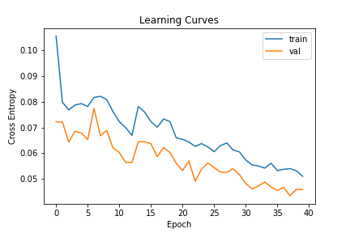
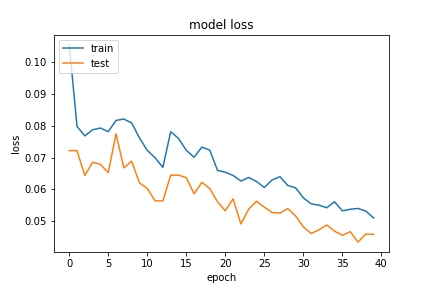
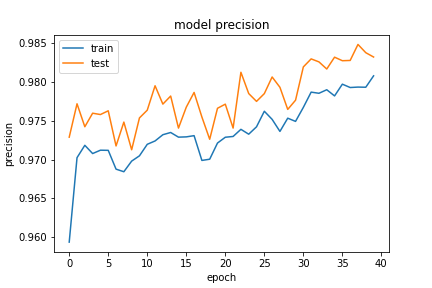
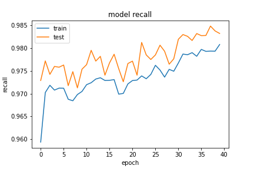

特徵部份把欄位只有一個值得欄位刪除。實作在 `data_value` 的 `column_del_one_value` 方法中。
```python
from tensorflow.keras import layers, Input, constraints
from tensorflow.keras import Model
dos_input = Input(shape=(X_train.shape[1],))

dense = layers.Dense(64, kernel_constraint=constraints.MaxNorm(max_value=4), name='nn3')(dos_input)
activation = layers.Activation(tf.nn.relu, name='nn3_relu')(dense)
drop = layers.GaussianDropout(0.5)(activation)
dense = layers.Dense(32, name='nn4')(drop)
noise = layers.GaussianNoise(0.5)(dense)
activation = layers.Activation(tf.nn.relu, name='nn4_relu')(noise)
dense = layers.Dense(16, name='nn5')(activation)
noise = layers.GaussianNoise(0.2)(dense)
activation = layers.Activation(tf.nn.relu, name='nn5_relu')(noise)
dense = layers.Dense(8, name='nn6')(activation)
activation = layers.Activation(tf.nn.relu, name='nn6_relu')(dense)
dense = layers.Dense(2, name='nn7')(activation)
output = layers.Activation(tf.nn.softmax, name='output')(dense)

model = Model(inputs=dos_input, outputs=output)
algorithm = tf.keras.optimizers.SGD(learning_rate=0.01, momentum=0.99, clipvalue=0.2, nesterov=True, name='SGD')

model.compile(optimizer=algorithm, loss='binary_crossentropy', metrics=modelmetric.metric('binary_crossentropy'))
```

- epoch=40
- batchsize=512


## evaluate
```
loss :  0.04492554813623428
tp :  204037.0
fp :  3385.0
tn :  204037.0
fn :  3385.0
acc :  0.4257889688014984
precision :  0.9836806058883667
recall :  0.9836806058883667
auc :  0.9987366795539856
binary_accuracy :  0.9836806058883667
binary_crossentropy :  0.04492554813623428
```

## predict
```
TrueNegatives result:  128385.0
TruePositives result:  75652.0
FalseNegatives result:  155.0
FalsePositives result:  3230.0
Recall result:  0.9979553
Precision result:  0.95905274
```

## fig




