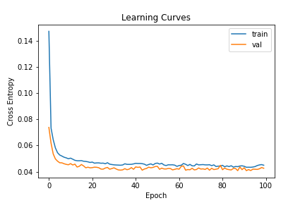
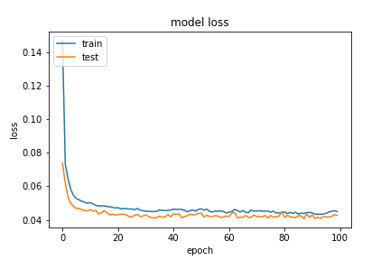
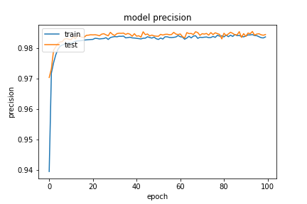
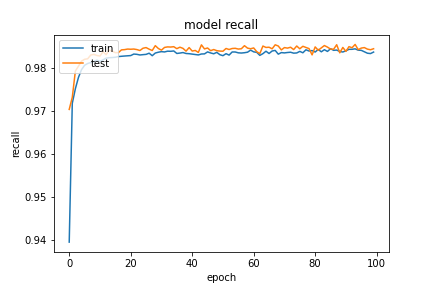

```python
from tensorflow.keras import layers, Input, constraints
from tensorflow.keras import Model
dos_input = Input(shape=(X_train.shape[1],))

dense = layers.Dense(256, name='nn1', kernel_constraint=constraints.MaxNorm(max_value=4))(dos_input)
activation = layers.Activation(tf.nn.relu, name='nn1_relu')(dense)
drop = layers.GaussianDropout(0.5)(activation)
dense = layers.Dense(128, name='nn2')(drop)
activation = layers.Activation(tf.nn.relu, name='nn2_relu')(dense)
noise = layers.GaussianNoise(0.5)(activation)
dense = layers.Dense(64, name='nn3')(noise)
activation = layers.Activation(tf.nn.relu, name='nn3_relu')(dense)
noise = layers.GaussianNoise(0.5)(activation)
dense = layers.Dense(32, name='nn4')(noise)
activation = layers.Activation(tf.nn.relu, name='nn4_relu')(dense)
noise = layers.GaussianNoise(0.5)(activation)
dense = layers.Dense(16, name='nn5')(noise)
activation = layers.Activation(tf.nn.relu, name='nn5_relu')(dense)
dense = layers.Dense(8, name='nn6')(activation)
activation = layers.Activation(tf.nn.relu, name='nn6_relu')(dense)
dense = layers.Dense(2, name='nn7')(activation)
output = layers.Activation(tf.nn.softmax, name='output')(dense)


model = Model(inputs=dos_input, outputs=output)

algorithm = tf.keras.optimizers.SGD(learning_rate=0.01, momentum=0.99, clipvalue=0.2, nesterov=True, name='SGD')

model.compile(optimizer=algorithm, loss='binary_crossentropy', metrics=modelmetric.metric('binary_crossentropy'))
```


- epoch=100
- batchsize=512


## evaluate
```
entropy: 0.0421
loss :  0.042132675647735596
tp :  204280.0
fp :  3142.0
tn :  204280.0
fn :  3142.0
acc :  0.3565388321876526
precision :  0.984852135181427
recall :  0.984852135181427
auc :  0.9988259077072144
binary_accuracy :  0.984852135181427
binary_crossentropy :  0.042132675647735596
```

## predict
```
TrueNegatives result:  129138.0
TruePositives result:  75142.0
FalseNegatives result:  147.0
FalsePositives result:  2995.0
Recall result:  0.99804753
Precision result:  0.96166986
```

## fig




