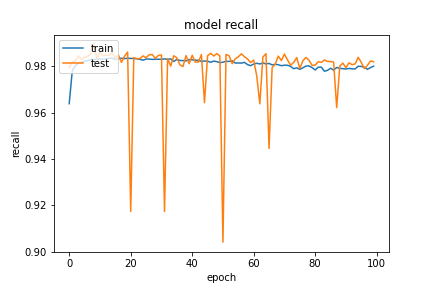

基於 `20200923-181126-network-RMSprop` 的架構
- Optimizer
    - learning_rate=0.001
    - momentum=0.9
    - decay= 1e-06
    - clipnorm=0.9
- epochs=100
- batch_size=512
- validation_split=0.3

##### 評估

```
loss :  0.05384029820561409
tp :  203985.0
fp :  3826.0
tn :  203985.0
fn :  3826.0
acc :  0.0
precision :  0.9815890192985535
recall :  0.9815890192985535
auc :  0.9977732300758362
binary_accuracy :  0.9815890192985535
binary_crossentropy :  0.05384029820561409
```

##### 預測

```
TrueNegatives result:  128504.0
TruePositives result:  75481.0
FalseNegatives result:  270.0
FalsePositives result:  3556.0
Recall result:  0.9964357
Precision result:  0.9550084
```

##### 圖片



