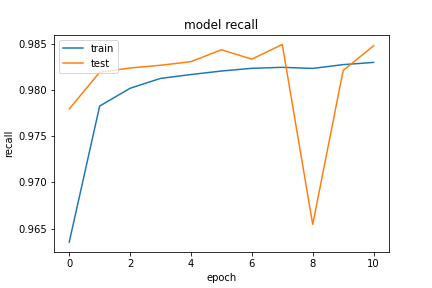

基於 `20200923-181126-network-RMSprop` 的架構
- Optimizer
    - learning_rate=0.001
    - momentum=0.9
    - decay= 1e-06
    - clipnorm=0.9
- epochs=100
- batch_size=512
- validation_split=0.3
- early Stopping
    - monitor='val_loss'
    - patience=3

##### 評估

```
loss :  0.0433691069483757
tp :  204636.0
fp :  3175.0
tn :  204636.0
fn :  3175.0
acc :  0.0
precision :  0.9847217202186584
recall :  0.9847217202186584
auc :  0.998832106590271
binary_accuracy :  0.9847217202186584
binary_crossentropy :  0.0433691069483757
```

##### 預測

```
TrueNegatives result:  129012.0
TruePositives result:  75624.0
FalseNegatives result:  178.0
FalsePositives result:  2997.0
Recall result:  0.99765176
Precision result:  0.9618804
```

##### 圖片



