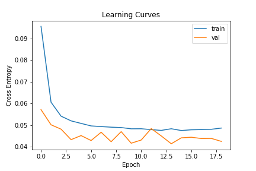
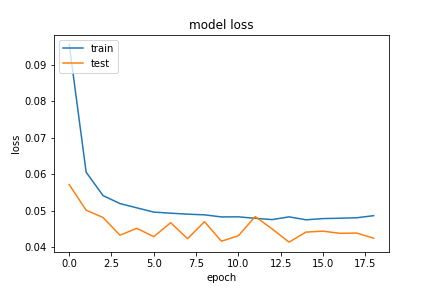
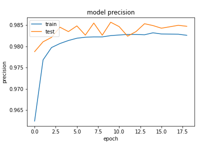
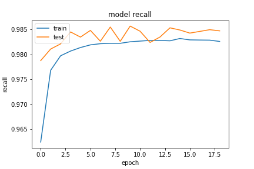

基於 `20200923-181126-network-RMSprop` 的架構
- Optimizer
    - learning_rate=0.001
    - momentum=0.9
    - decay= 1e-06
    - clipnorm=0.9
- epochs=100
- batch_size=512
- validation_split=0.3
- early Stopping
    - monitor='val_loss'
    - patience=5

##### 評估

```
loss :  0.04279198497533798
tp :  204626.0
fp :  3185.0
tn :  204626.0
fn :  3185.0
acc :  0.0
precision :  0.9846735596656799
recall :  0.9846735596656799
auc :  0.998668372631073
binary_accuracy :  0.9846735596656799
binary_crossentropy :  0.04279198497533798
```

##### 預測

```
TrueNegatives result:  128867.0
TruePositives result:  75759.0
FalseNegatives result:  200.0
FalsePositives result:  2985.0
Recall result:  0.997367
Precision result:  0.96209234
```

##### 圖片




