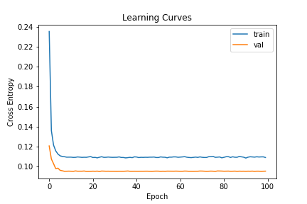
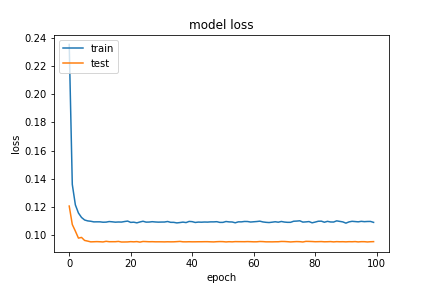
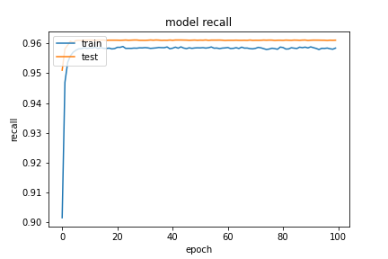
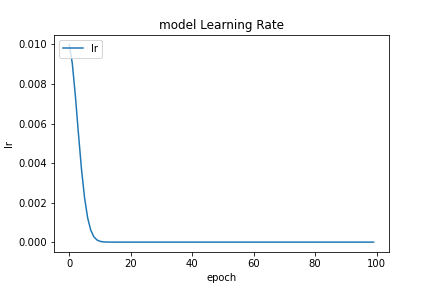

基於 `20200923-181126-network-RMSprop` 的架構
- Optimizer
    - learning_rate=0.01
    - momentum=0.95
    - clipnorm=0.9
- epochs=100
- batch_size=512
- validation_split=0.3

##### 評估

```
loss :  0.09409674257040024
tp :  199835.0
fp :  7976.0
tn :  199835.0
fn :  7976.0
acc :  0.0
precision :  0.961618959903717
recall :  0.961618959903717
auc :  0.9946655035018921
binary_accuracy :  0.961618959903717
binary_crossentropy :  0.09409674257040024
```

##### 預測

```
TrueNegatives result:  125322.0
TruePositives result:  74513.0
FalseNegatives result:  1365.0
FalsePositives result:  6611.0
Recall result:  0.9820106
Precision result:  0.91850746
```

##### 圖片





