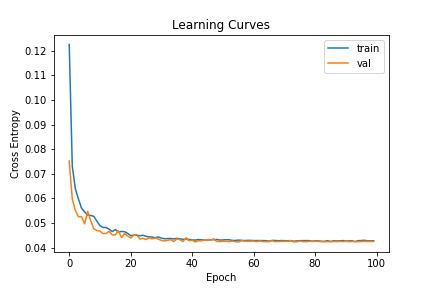
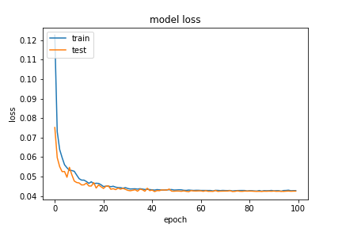
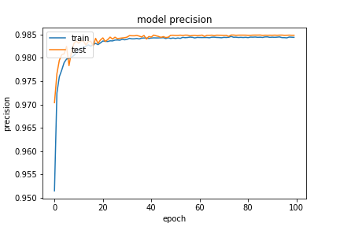
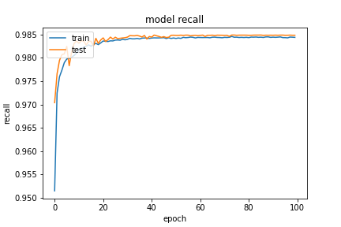
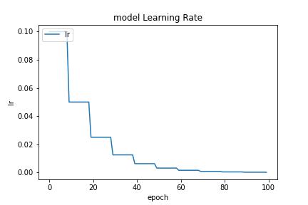

基於 `20200923-181126-network-RMSprop` 的架構
- Optimizer
    - learning_rate=0.0199
    - momentum=0.99
    - clipvalue=0.3
- epochs=100
- batch_size=512
- validation_split=0.3

##### 評估

```
loss :  0.04165176302194595
tp :  204785.0
fp :  3026.0
tn :  204785.0
fn :  3026.0
acc :  0.0
precision :  0.9854387044906616
recall :  0.9854387044906616
auc :  0.9988021850585938
binary_accuracy :  0.9854387044906616
binary_crossentropy :  0.04165176302194595
```

##### 預測

```
TrueNegatives result:  129249.0
TruePositives result:  75536.0
FalseNegatives result:  146.0
FalsePositives result:  2880.0
Recall result:  0.9980709
Precision result:  0.9632728
```

##### 圖片





