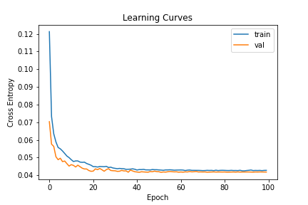
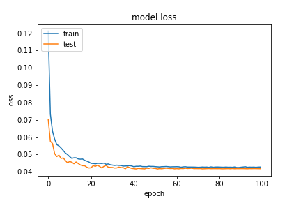
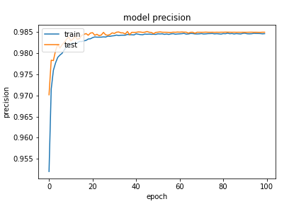
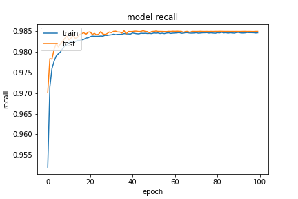

基於 `20200923-181126-network-RMSprop` 的架構
- Optimizer
    - learning_rate=0.0199
        - step_decay
    - momentum=0.99
    - clipvalue=0.3
- epochs=100
- batch_size=512
- validation_split=0.3

##### 評估

```
loss :  0.0410015732049942
tp :  204783.0
fp :  3028.0
tn :  204783.0
fn :  3028.0
acc :  0.0
precision :  0.985429048538208
recall :  0.985429048538208
auc :  0.9988391399383545
binary_accuracy :  0.985429048538208
binary_crossentropy :  0.0410015732049942
```

##### 預測

```
TrueNegatives result:  129263.0
TruePositives result:  75520.0
FalseNegatives result:  142.0
FalsePositives result:  2886.0
Recall result:  0.9981232
Precision result:  0.96319157
```

##### 圖片





