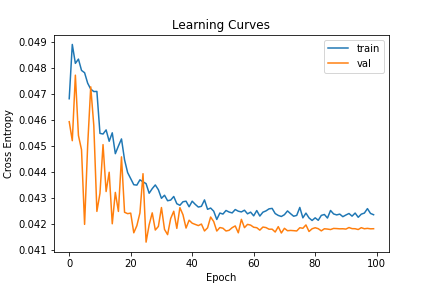
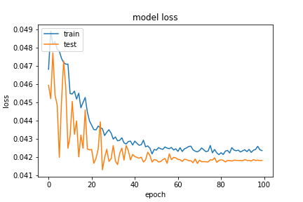
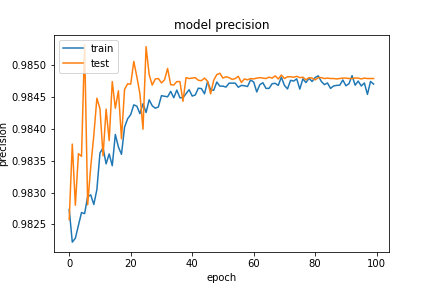
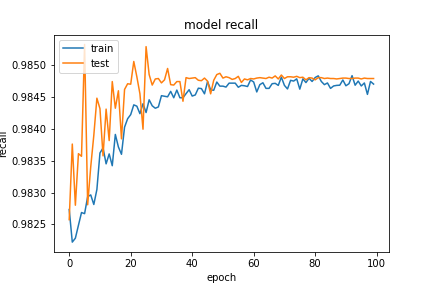

基於 `20200923-181126-network-RMSprop` 的架構
- Optimizer
    - learning_rate=0.0159
        - step_decay
    - momentum=0.99
    - clipvalue=0.3
    - decay= 1e-06
- epochs=100
- batch_size=512
- validation_split=0.3

##### 評估

```
loss :  0.040848974138498306
tp :  204796.0
fp :  3015.0
tn :  204796.0
fn :  3015.0
acc :  0.0
precision :  0.9854916334152222
recall :  0.9854916334152222
auc :  0.9987990856170654
binary_accuracy :  0.9854916334152222
binary_crossentropy :  0.040848974138498306
```

##### 預測

```
TrueNegatives result:  129205.0
TruePositives result:  75591.0
FalseNegatives result:  147.0
FalsePositives result:  2868.0
Recall result:  0.9980591
Precision result:  0.9634459
```

##### 圖片





