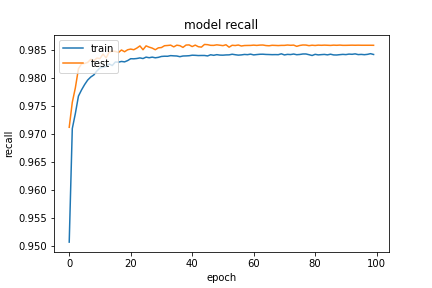
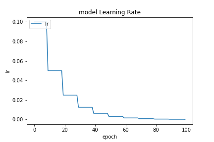

基於 `20200923-181126-network-RMSprop` 的架構
- Optimizer
    - learning_rate=0.0139
        - step_decay
    - momentum=0.99
    - clipvalue=0.3
    - decay= 1e-06
- epochs=100
- batch_size=512
- validation_split=0.3

##### 評估

```
loss :  0.04167960211634636
tp :  204717.0
fp :  3094.0
tn :  204717.0
fn :  3094.0
acc :  0.0015278306091204286
precision :  0.9851114749908447
recall :  0.9851114749908447
auc :  0.9989056587219238
binary_accuracy :  0.9851114749908447
binary_crossentropy :  0.04167960211634636
```

##### 預測

```
TrueNegatives result:  129065.0
TruePositives result:  75652.0
FalseNegatives result:  148.0
FalsePositives result:  2946.0
Recall result:  0.9980475
Precision result:  0.96251816
```

##### 圖片




