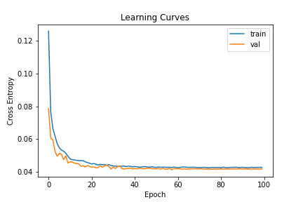
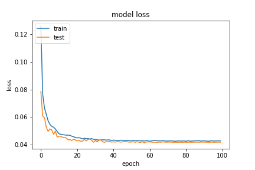
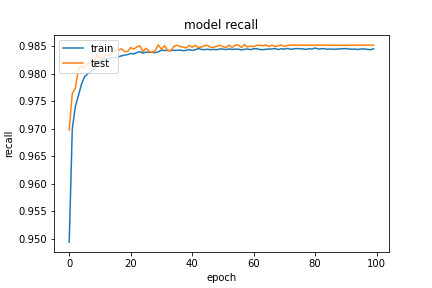

基於 `20200923-181126-network-RMSprop` 的架構
- Optimizer
    - learning_rate=0.0199
        - step_decay
    - momentum=0.99
    - clipvalue=0.3
    - decay= 1e-06
- epochs=100
- batch_size=512
- validation_split=0.3

##### 評估

```
loss :  0.04237605631351471
tp :  204680.0
fp :  3131.0
tn :  204680.0
fn :  3131.0
acc :  0.0
precision :  0.9849334359169006
recall :  0.9849334359169006
auc :  0.9987533688545227
binary_accuracy :  0.9849334359169006
binary_crossentropy :  0.04237605631351471
```

##### 預測

```
TrueNegatives result:  129073.0
TruePositives result:  75607.0
FalseNegatives result:  153.0
FalsePositives result:  2978.0
Recall result:  0.9979805
Precision result:  0.96210474
```

##### 圖片





