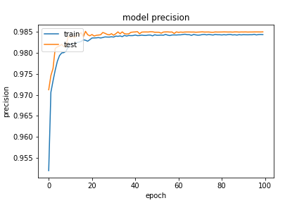

基於 `20200923-181126-network-RMSprop` 的架構
- Optimizer
    - learning_rate=0.05
        - step_decay
    - momentum=0.99
    - clipvalue=0.2
    - decay= 1e-06
- epochs=100
- batch_size=512
- validation_split=0.3

##### 評估

```
loss :  0.0407036729156971
tp :  204786.0
fp :  3025.0
tn :  204786.0
fn :  3025.0
acc :  0.0
precision :  0.9854435324668884
recall :  0.9854435324668884
auc :  0.9989560842514038
binary_accuracy :  0.9854435324668884
binary_crossentropy :  0.0407036729156971
```

##### 預測

```
TrueNegatives result:  129134.0
TruePositives result:  75652.0
FalseNegatives result:  120.0
FalsePositives result:  2905.0
Recall result:  0.9984163
Precision result:  0.9630205
```

##### 圖片





