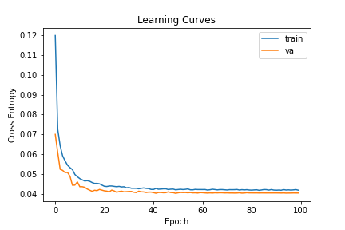
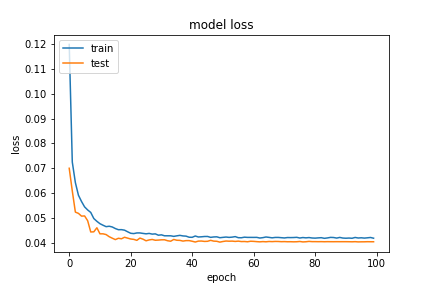
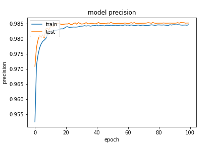
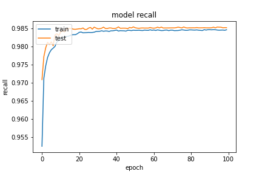
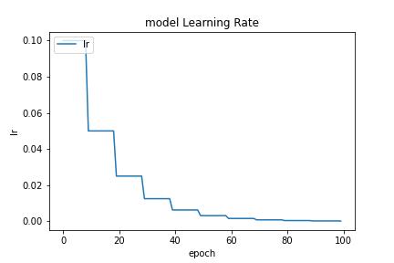

因為儲存 `model` 問題因此直接使用 Keras 中 Function API 方式建立網路，架構與 `20200923-181126-network-RMSprop` 的架構一致。大致上都沒有改變，只是這邊因為資料前處裡部分有做些正

```python
def inf_and_na_drop(dataframe):
    dataframe = dataframe.replace(['Infinity', np.inf, -np.inf], np.nan)
    return dataframe.dropna(axis=0) # 這邊改為 0 原本是 1
```

- Optimizer
    - learning_rate=0.05
        - step_decay
    - momentum=0.99
    - clipvalue=0.3
    - decay= 1e-06
- epochs=100
- batch_size=512
- validation_split=0.3

##### 評估

```
loss :  0.04015178233385086
tp :  204424.0
fp :  2998.0
tn :  204424.0
fn :  2998.0
acc :  0.011001725681126118
precision :  0.985546350479126
recall :  0.985546350479126
auc :  0.9989038109779358
binary_accuracy :  0.985546350479126
binary_crossentropy :  0.04015178233385086
```

##### 預測

```
TrueNegatives result:  129157.0
TruePositives result:  75267.0
FalseNegatives result:  134.0
FalsePositives result:  2864.0
Recall result:  0.9982228
Precision result:  0.9633436
```

##### 圖片





