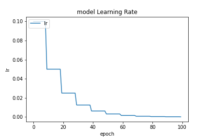

因為儲存 `model` 問題因此直接使用 Keras 中 Function API 方式建立網路，架構與 `20200923-181126-network-RMSprop` 的架構一致。大致上都沒有改變，只是這邊因為資料前處裡部分有做些正

```python
def inf_and_na_drop(dataframe):
    dataframe = dataframe.replace(['Infinity', np.inf, -np.inf], np.nan)
    return dataframe.dropna(axis=0) # 這邊改為 0 原本是 1
```

- Optimizer
    - learning_rate=0.05
        - step_decay
    - momentum=0.99
    - clipvalue=0.2
- epochs=100
- batch_size=512
- validation_split=0.3

##### 評估

```
loss :  0.04058768227696419
tp :  204340.0
fp :  3082.0
tn :  204340.0
fn :  3082.0
acc :  0.0
precision :  0.985141396522522
recall :  0.985141396522522
auc :  0.9989209771156311
binary_accuracy :  0.985141396522522
binary_crossentropy :  0.04058768227696419
```

##### 預測

```
TrueNegatives result:  128907.0
TruePositives result:  75433.0
FalseNegatives result:  131.0
FalsePositives result:  2951.0
Recall result:  0.9982664
Precision result:  0.96235204
```

##### 圖片



