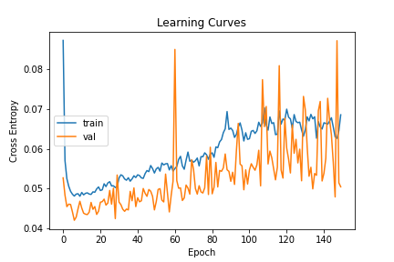
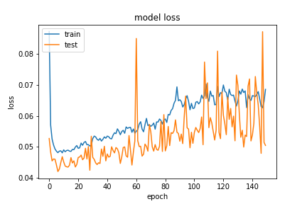
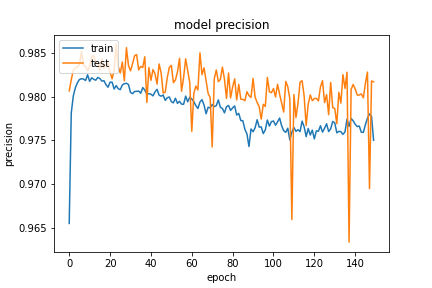
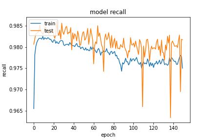

因為儲存 `model` 問題因此直接使用 Keras 中 Function API 方式建立網路，架構與 `20200923-181126-network-RMSprop` 的架構一致。大致上都沒有改變，只是這邊因為資料前處裡部分有做些正

```python
def inf_and_na_drop(dataframe):
    dataframe = dataframe.replace(['Infinity', np.inf, -np.inf], np.nan)
    return dataframe.dropna(axis=0) # 這邊改為 0 原本是 1
```

- Optimizer
    - learning_rate=0.00125
    - momentum=0.9
    - clipnorm=0.9
    - decay=1e-07
- epochs=150
- batch_size=512
- validation_split=0.3

##### 評估

```
loss :  0.05289645493030548
tp :  203467.0
fp :  3955.0
tn :  203467.0
fn :  3955.0
acc :  0.0
precision :  0.9809325933456421
recall :  0.9809325933456421
auc :  0.9974462389945984
binary_accuracy :  0.9809325933456421
binary_crossentropy :  0.05289645493030548
```

##### 預測

```
TrueNegatives result:  128845.0
TruePositives result:  74622.0
FalseNegatives result:  875.0
FalsePositives result:  3080.0
Recall result:  0.9884101
Precision result:  0.96036136
```

##### 圖片







整體震動很大，且 loss 有上升的趨勢