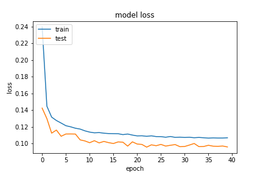
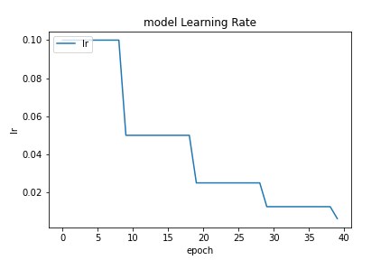

基於 `20200923-181126-network-RMSprop` 的架構
- Optimizer
    - learning_rate=0.01
        - step_decay
    - momentum=0.99
    - clipvalue=0.3
    - decay= 1e-06
- epochs=40
- batch_size=512
- validation_split=0.3

##### 評估

```
loss :  0.09644519537687302
tp :  199803.0
fp :  8008.0
tn :  199803.0
fn :  8008.0
acc :  0.10478030890226364
precision :  0.9614650011062622
recall :  0.9614650011062622
auc :  0.9940944910049438
binary_accuracy :  0.9614650011062622
binary_crossentropy :  0.09644519537687302
```

##### 預測

```
TrueNegatives result:  124557.0
TruePositives result:  75246.0
FalseNegatives result:  723.0
FalsePositives result:  7285.0
Recall result:  0.990483
Precision result:  0.9117301
```

##### 圖片





