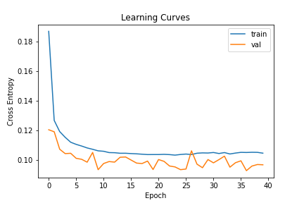
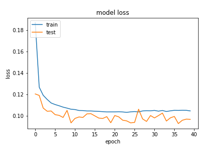
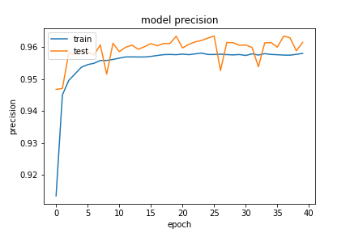
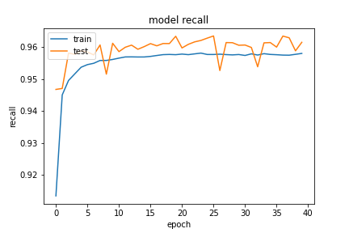

基於 `20200923-181126-network-RMSprop` 的架構
- Optimizer
    - learning_rate=0.001
    - momentum=0.9
    - clipnorm=0.9
    - decay= 1e-06
- epochs=40
- batch_size=512
- validation_split=0.3

##### 評估

```
loss :  0.09664250910282135
tp :  199893.0
fp :  7918.0
tn :  199893.0
fn :  7918.0
acc :  0.0
precision :  0.9618980884552002
recall :  0.9618980884552002
auc :  0.9938187599182129
binary_accuracy :  0.9618980884552002
binary_crossentropy :  0.09664250910282135
```

##### 預測

```
TrueNegatives result:  124542.0
TruePositives result:  75351.0
FalseNegatives result:  686.0
FalsePositives result:  7232.0
Recall result:  0.99097806
Precision result:  0.9124275
```

##### 圖片





