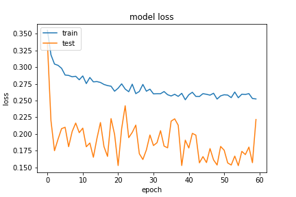
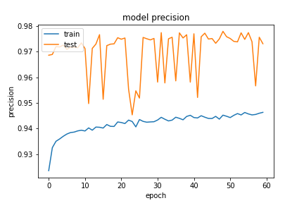
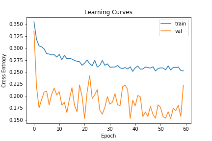

## Network10
有新增一些評估對象，從下面來看增加一層神經網路 `recall` 提升至 0.99。`loss` 降的也比之前還低。

### 20200919-220917-network10-RMSprop
- optimizer
    - learning_rate=0.015
    - momentum=0.9
    - decay= 1e-06
- epoch=60
- batchsize=512
##### evaluate
```
loss :  0.2224503606557846
tp :  202174.0
fp :  5637.0
tn :  202174.0
fn :  5637.0
acc :  0.0
precision :  0.9728744029998779
recall :  0.9728744029998779
auc :  0.9968684315681458
binary_accuracy :  0.9728744029998779
binary_crossentropy :  0.072150319814682
```
##### predict
```
TrueNegatives result:  126650.0
TruePositives result:  75524.0
FalseNegatives result:  286.0
FalsePositives result:  5351.0
Recall result:  0.9962274
Precision result:  0.93383616
```

##### fig



