## Network11

### 20200921-141604-network11-RMSprop
- optimizer
    - learning_rate=0.015
    - momentum=0.9
    - decay= 1e-06
- epochs=40
- batch_size=512

##### evaluate
```
loss :  0.3218422830104828
tp :  202128.0
fp :  5683.0
tn :  202128.0
fn :  5683.0
acc :  0.0
precision :  0.9726530313491821
recall :  0.9726530313491821
auc :  0.9939000010490417
binary_accuracy :  0.9726530313491821
binary_crossentropy :  0.11601424217224121
```

##### predict
```
TrueNegatives result:  127504.0
TruePositives result:  74624.0
FalseNegatives result:  1053.0
FalsePositives result:  4630.0
Recall result:  0.9860856
Precision result:  0.94158024
```

##### Fig
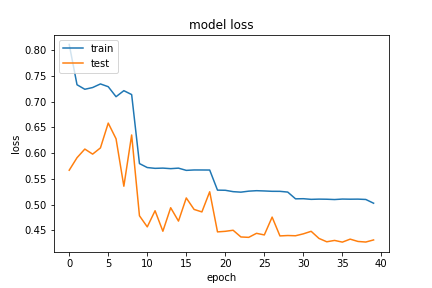
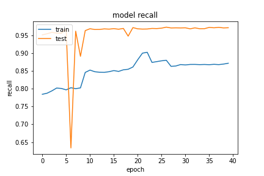
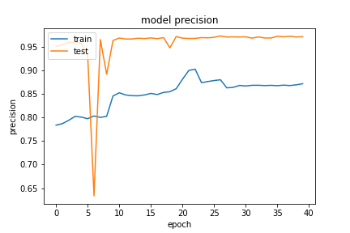
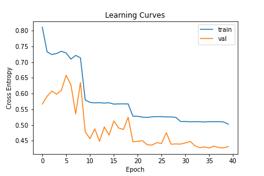


### 20200921-141604-network11-RMSprop
- optimizer
    - learning_rate=0.015
        - step_decay
    - momentum=0.9
    - decay= 1e-06
- epochs=40
- batch_size=512

##### evaluate
```
loss :  0.43092676997184753
tp :  201869.0
fp :  5942.0
tn :  201869.0
fn :  5942.0
acc :  0.0
precision :  0.9714066982269287
recall :  0.9714066982269287
auc :  0.9936761260032654
binary_accuracy :  0.9714066982269287
binary_crossentropy :  0.28207629919052124
```

##### predict
```
TrueNegatives result:  127571.0
TruePositives result:  74298.0
FalseNegatives result:  1307.0
FalsePositives result:  4635.0
Recall result:  0.9827128
Precision result:  0.9412793
```

##### Fig


### 20200921-145044-network11-RMSprop
- optimizer
    - learning_rate=0.015
        - step_decay
    - momentum=0.9
    - decay= 1e-06
- epochs=100
- batch_size=512

##### evaluate
```
loss :  0.4223862886428833
tp :  202018.0
fp :  5793.0
tn :  202018.0
fn :  5793.0
acc :  0.0
precision :  0.9721236824989319
recall :  0.9721236824989319
auc :  0.9911196827888489
binary_accuracy :  0.9721236824989319
binary_crossentropy :  0.2806012034416199
```

##### predict
```
TrueNegatives result:  127571.0
TruePositives result:  74298.0
FalseNegatives result:  1307.0
FalsePositives result:  4635.0
Recall result:  0.9827128
Precision result:  0.9412793
```

##### Fig
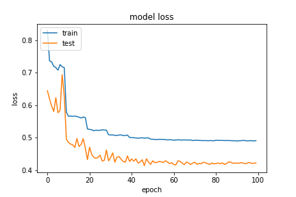
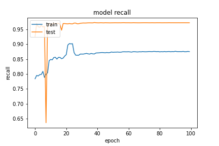
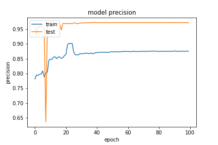
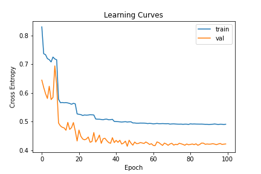


## SGD
### 20200921-002717-network11-SGD
- optimizer
    - learning_rate=0.015
        - step_decay
    - clipnorm=0.9
    - momentum=0.95
    - nesterov=True
- epochs=40
- batch_size=512

##### evaluate
```
loss :  0.6571605205535889
tp :  131990.0
fp :  75821.0
tn :  131990.0
fn :  75821.0
acc :  0.0
precision :  0.6351444125175476
recall :  0.6351444125175476
auc :  0.6351444721221924
binary_accuracy :  0.6351444125175476
binary_crossentropy :  0.6561594009399414
```

##### predict
```
TrueNegatives result:  131990.0
TruePositives result:  0.0
FalseNegatives result:  75821.0
FalsePositives result:  0.0
Recall result:  0.0
Precision result:  0.0
```

##### Fig
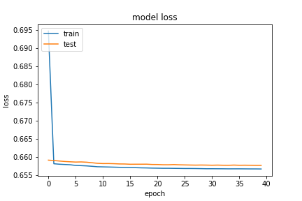
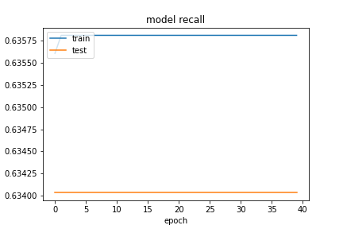
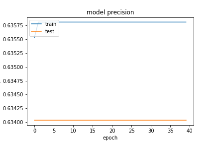
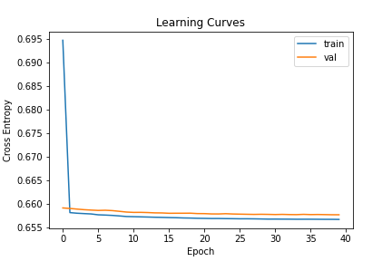
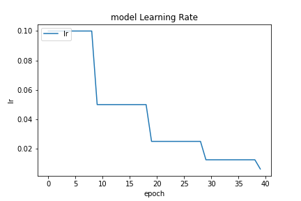

### 20200921-012022-network11-SGD
- optimizer
    - learning_rate=0.015
        - exp_decay
    - clipnorm=0.9
    - momentum=0.95
    - nesterov=True
- epochs=40
- batch_size=512

##### evaluate
```
loss :  0.6586745381355286
tp :  131974.0
fp :  75837.0
tn :  131974.0
fn :  75837.0
acc :  0.0
precision :  0.6350674629211426
recall :  0.6350674629211426
auc :  0.6350674629211426
binary_accuracy :  0.6350674629211426
binary_crossentropy :  0.6562016010284424
```

##### predict
```
TrueNegatives result:  131974.0
TruePositives result:  0.0
FalseNegatives result:  75837.0
FalsePositives result:  0.0
Recall result:  0.0
Precision result:  0.0
```

##### Fig
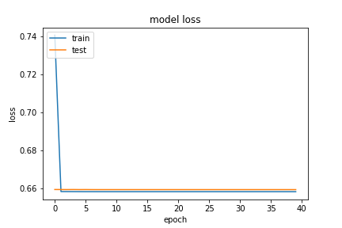
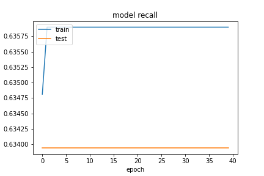
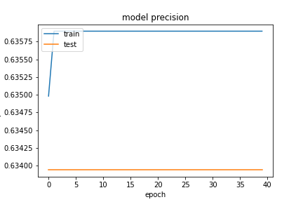
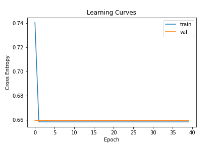
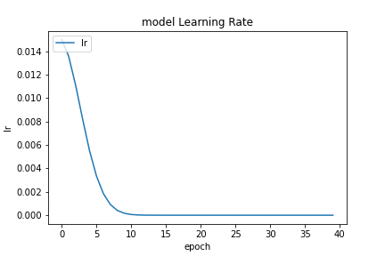


