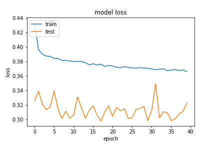
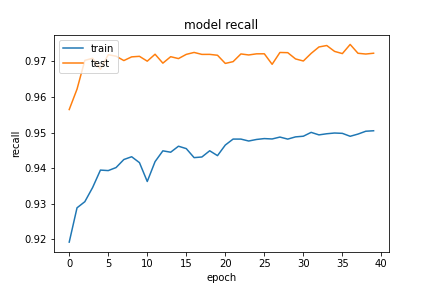
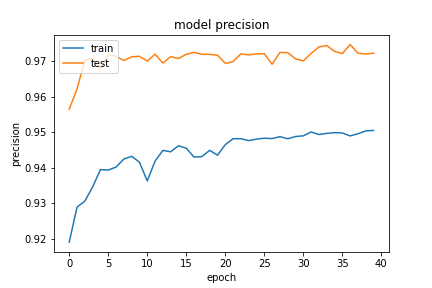
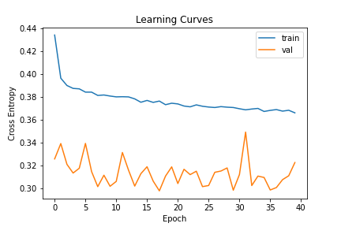

## Network11

##### 20200920-122742-network11-RMSprop
- optimizer
    - learning_rate=0.015
    - momentum=0.9
    - decay= 1e-06
- epochs=40
- batch_size=512

##### evaluate
```
loss :  0.3218422830104828
tp :  202128.0
fp :  5683.0
tn :  202128.0
fn :  5683.0
acc :  0.0
precision :  0.9726530313491821
recall :  0.9726530313491821
auc :  0.9939000010490417
binary_accuracy :  0.9726530313491821
binary_crossentropy :  0.11601424217224121
```

##### predict
```
TrueNegatives result:  127504.0
TruePositives result:  74624.0
FalseNegatives result:  1053.0
FalsePositives result:  4630.0
Recall result:  0.9860856
Precision result:  0.94158024
```

##### Fig



