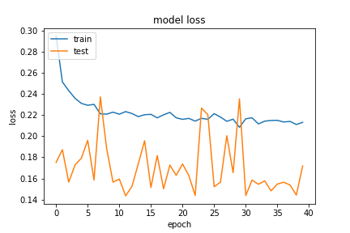
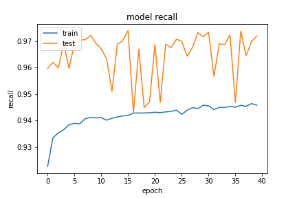
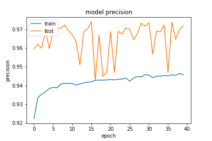
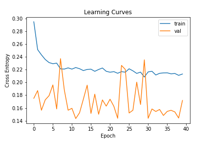

## Network11
### 20200921-180421-network12-RMSprop
- optimizer
    - learning_rate=0.015
    - momentum=0.9
    - decay= 1e-06
- epochs=40
- batch_size=512

##### evaluate
```
loss :  0.1728069931268692
tp :  201921.0
fp :  5890.0
tn :  201921.0
fn :  5890.0
acc :  0.0
precision :  0.9716569185256958
recall :  0.9716569185256958
auc :  0.9958105087280273
binary_accuracy :  0.9716569185256958
binary_crossentropy :  0.07752346992492676
```

##### predict
```
TrueNegatives result:  127648.0
TruePositives result:  74273.0
FalseNegatives result:  1421.0
FalsePositives result:  4469.0
Recall result:  0.98122704
Precision result:  0.94324505
```

##### Fig




