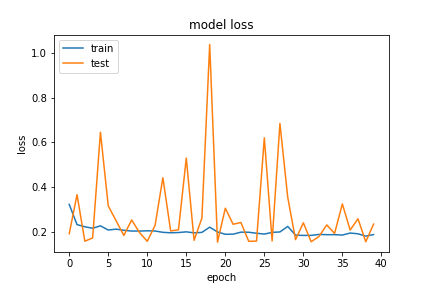
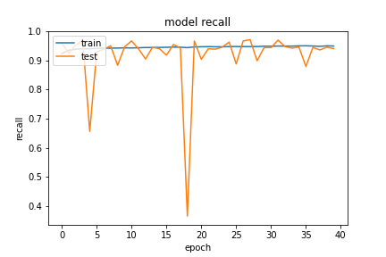
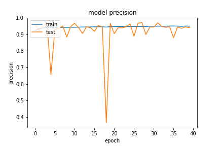
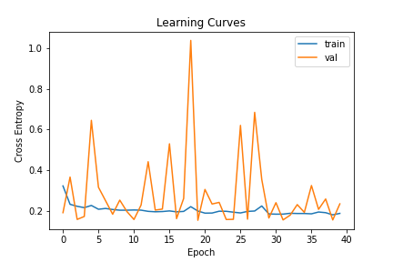
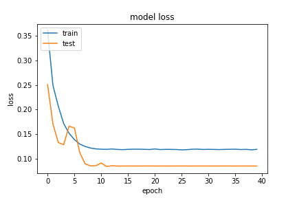
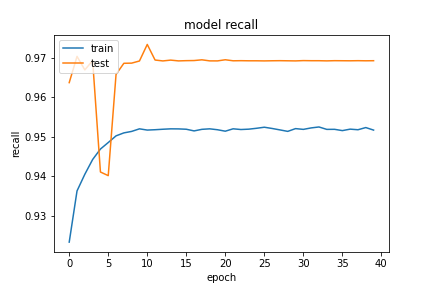
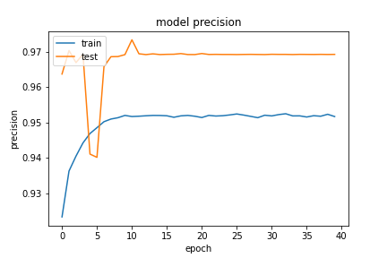
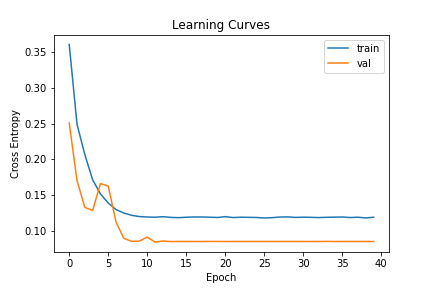
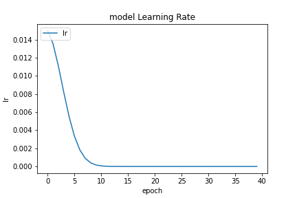

## Network11
### 20200922-162525-network12-RMSprop
- optimizer
    - learning_rate=0.015
    - momentum=0.9
    - decay= 1e-06
- epochs=40
- batch_size=512

##### evaluate
```
loss :  0.23443619906902313
tp :  195652.0
fp :  12159.0
tn :  195652.0
fn :  12159.0
acc :  0.0
precision :  0.941490113735199
recall :  0.941490113735199
auc :  0.9813254475593567
binary_accuracy :  0.941490113735199
binary_crossentropy :  0.16825860738754272
```

##### predict
```
TrueNegatives result:  119946.0
TruePositives result:  75706.0
FalseNegatives result:  202.0
FalsePositives result:  11957.0
Recall result:  0.9973389
Precision result:  0.86360264
```

##### Fig






##### Network Arch
```python
        self.forward_layer_one = layers.LSTM(32, dropout=0.5, return_sequences=True) # kernel_regularizer=tf.keras.regularizers.l2(10e-06)
        self.backward_layer_one = layers.LSTM(32, dropout=0.5, return_sequences=True , go_backwards=True) # kernel_regularizer=tf.keras.regularizers.l2(10e-06)
        self.bi_one = layers.Bidirectional(self.forward_layer_one, backward_layer=self.backward_layer_one, name='bi_one')

        self.forward_layer_two = layers.LSTM(16, kernel_regularizer=tf.keras.regularizers.l2(10e-06), dropout=0.5)
        self.backward_layer_two = layers.LSTM(16, kernel_regularizer=tf.keras.regularizers.l2(10e-06), dropout=0.5, go_backwards=True)
        self.bi_two = layers.Bidirectional(self.forward_layer_two, backward_layer=self.backward_layer_two, name='bi_two')

        self.drop_two = layers.BatchNormalization()

        self.flatten_one = layers.Flatten()

        self.dense_three = layers.Dense(16, kernel_regularizer=tf.keras.regularizers.l2(1e-01), activity_regularizer=tf.keras.regularizers.l1(1e-03) ,name='dense_three')
        self.avtivation_three = layers.Activation(tf.nn.relu6, name='dense_three_activation')
        
        self.drop_three = layers.BatchNormalization()

        self.dense_four = layers.Dense(8, kernel_regularizer=tf.keras.regularizers.l2(1e-01), activity_regularizer=tf.keras.regularizers.l1(1e-03) ,name='dense_three')
        self.avtivation_four = layers.Activation(tf.nn.relu6, name='dense_four_activation')

        self.dense = layers.Dense(2, name='classification') # , kernel_regularizer=tf.keras.regularizers.l2(1e-01), activity_regularizer=tf.keras.regularizers.l1(1e-03)
        self.output_res = layers.Activation(tf.nn.softmax, name='classifi')
```

### 20200922-173701-network12-RMSprop
- optimizer
    - learning_rate=0.015
        - exp_decay
    - momentum=0.9
    - decay= 1e-06
- epochs=40
- batch_size=512

##### evaluate
```
loss :  0.08476649224758148
tp :  201469.0
fp :  6342.0
tn :  201469.0
fn :  6342.0
acc :  0.0
precision :  0.969481885433197
recall :  0.969481885433197
auc :  0.9960823059082031
binary_accuracy :  0.969481885433197
binary_crossentropy :  0.08089711517095566
```

##### predict
```
TrueNegatives result:  127710.0
TruePositives result:  73759.0
FalseNegatives result:  2195.0
FalsePositives result:  4147.0
Recall result:  0.9711009
Precision result:  0.9467692
```

##### Fig




