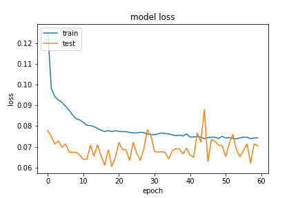

## Network6
在 `Network6` 中設定為三層 `BI-LSTM` 其神經元分別是 32、16 和 8 和一層神經網路神經元為 3。因為原本神經元為 8 的神經網路，相較於 `BI-LSTM` 計算較沒複雜，因此這邊嘗試替換。

從以下訓練結果來看，`optimizer` 和 `batch_size` 沒有變化，設定如下
- optimizer
    - learning_rate=0.01
    - momentum=0.89
- train
    - batch_size=512

`epoch` 則是使用 `40` 和 `60` 進行觀察，結果和前面的架構是大同小異。接著觀察 `loss`，在 `epoch` 為 40 下，明顯的有越來越穩定也就是有擬合的味道。




##### 20200916-163718-network6-RMSprop

- epochs=40
- predict
```
TrueNegatives result:  128001.0
TruePositives result:  73529.0
FalseNegatives result:  2047.0
FalsePositives result:  3845.0
Recall result:  0.9729147
Precision result:  0.9503063
```
- fig
    - figure/20200916-163718-network6-RMSprop

##### 20200916-213613-network6-RMSprop
- epochs=60
- predict
```
TrueNegatives result:  127518.0
TruePositives result:  74774.0
FalseNegatives result:  802.0
FalsePositives result:  4328.0
Recall result:  0.98938817
Precision result:  0.94528586
```
- fig
    - figure/20200916-213613-network6-RMSprop

