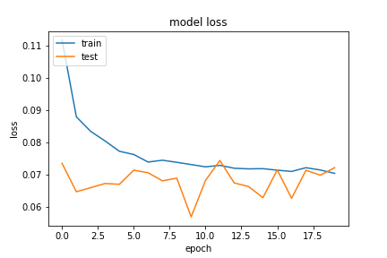
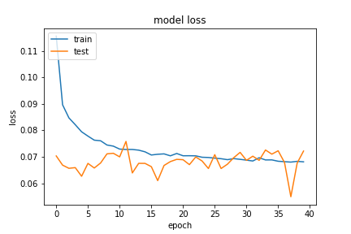

## Network7
這邊是使用 `Network2` 的架構，只是正規化部分，只有針對 `weight`。有一個想法是會不會約束的太緊，導致學習時會欠擬合。因此這邊就做了改善。

從以下訓練結果來看，`optimizer` 和 `batch_size` 沒有變化，設定如下
- optimizer
    - learning_rate=0.01
    - momentum=0.89
- train
    - batch_size=512

向較於 `network`、和 `network2` 的架構來說，`recall` 確實有比較好一點。但我們可以觀察 `loss`，穩定了很多，因此正規化的調整有待去釐清。

network7
 network2

network7

network2
##### 20200917-095738-network7-RMSprop
- epochs=20
- predict
```
TrueNegatives result:  128248.0
TruePositives result:  73293.0
FalseNegatives result:  2155.0
FalsePositives result:  3726.0
Recall result:  0.9714373
Precision result:  0.9516223
```
- fig
    - figure/20200917-095738-network7-RMSprop

##### 20200917-101054-network7-RMSprop
- epochs=40
- predict
```
TrueNegatives result:  128460.0
TruePositives result:  73360.0
FalseNegatives result:  2088.0
FalsePositives result:  3514.0
Recall result:  0.9723253
Precision result:  0.95428884
```
- fig
    - figure/20200917-101054-network7-RMSprop