## Network8
##### 20200917-124949-network8-RMSprop
- optimizer
    - learning_rate=0.01
    - momentum=0.89
- train
    - epoch=20
    - batch_size=512
    - cla
- predict
```
TrueNegatives result:  127399.0
TruePositives result:  74608.0
FalseNegatives result:  1043.0
FalsePositives result:  4761.0
Recall result:  0.986213
Precision result:  0.94001436
```
- fig
    - figure/20200917-124949-network8-RMSprop
從下面訓練時的 `Recall` 和 `precision` 來看是有問題的，在看 `loss` 是完全未擬合，後來發現是因為我們將分類數量從 3 變 2，也就是最後一層神經網路將其調整成分類成 2 類，但未調整到 `loss function` 的方法，導致出現以下原因

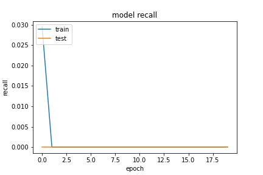
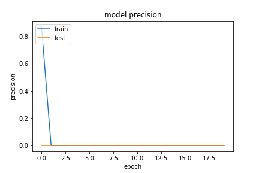

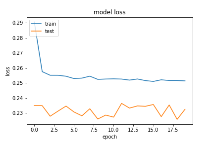


### 不同資料前處理效果

優化器參數和訓練參數的值

- optimizer
    - learning_rate=0.01
    - momentum=0.89
- train
    - epoch=20
    - batch_size=512

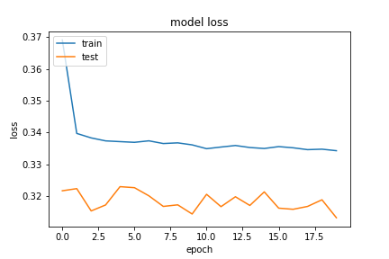 

將 infinity 和 nan 的欄位刪除

 

使用將 infinity 刪除，nan 用 ffill 方式補值

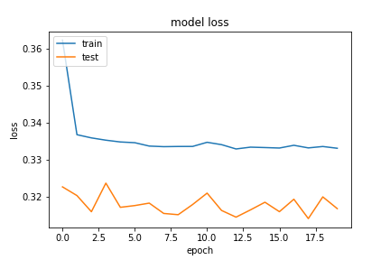 

使用將 infinity 用一個數值做取代，nan 用 ffill 方式補值

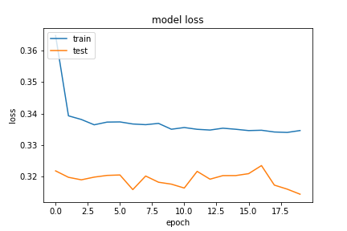 

使用將 infinity 刪除，nan 用 quadratic 方式補值


最後訓練的 `loss` 都大致在 0.34 左右，然後預測的 `recall` 大約在 0.98 左右，`precision` 在 0.94 左右，這些資訊來看相較於前面，有些許的差。但這邊主要是測試針對不同的資料處裡方式對訓練有何影響，目前看來影響很小。

##### 20200917-140400-network8-RMSprop
這是修正 `20200917-124949-network8-RMSprop` 後的結果，將 `loss function` 變成 `binary_crossentropy` 就解決了問題。但是結果也不是很理想
- 使用 `inf_and_na_drop` 資料前處理
- predict
```
TrueNegatives result:  127505.0
TruePositives result:  74490.0
FalseNegatives result:  1262.0
FalsePositives result:  4554.0
Recall result:  0.9833404
Precision result:  0.9423865
```
- fig
    - figure/20200917-140400-network8-RMSprop

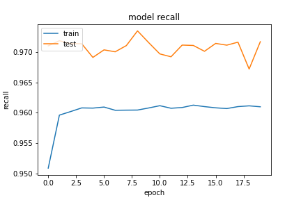
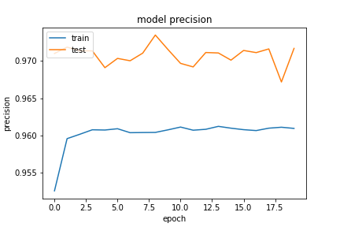


##### 20200917-144439-network8-RMSprop

- 使用 `inf_drop_insert_nan` 資料前處理
- predict
```
TrueNegatives result:  127110.0
TruePositives result:  74376.0
FalseNegatives result:  1268.0
FalsePositives result:  5057.0
Recall result:  0.98323727
Precision result:  0.9363363
```
- fig
    - figure/20200917-144439-network8-RMSprop

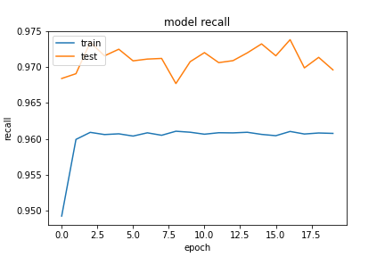
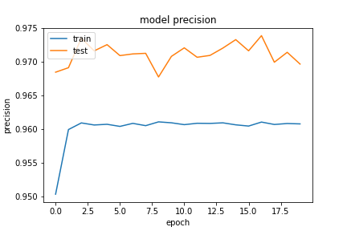


##### 20200917-150400-network8-RMSprop

- 使用 `inf_replace_value_ffill_nan` 資料前處理
- predict
```
TrueNegatives result:  127506.0
TruePositives result:  74451.0
FalseNegatives result:  1188.0
FalsePositives result:  4666.0
Recall result:  0.9842938
Precision result:  0.94102407
```
- fig
    - figure/20200917-150400-network8-RMSprop

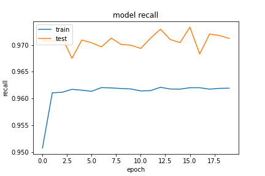
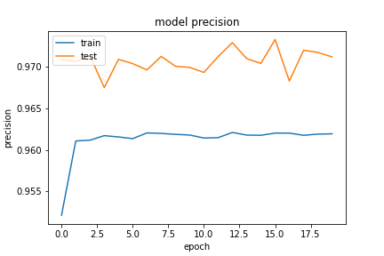


##### 20200917-161711-network8-RMSprop
- 使用 `inf_drop_insert_nan(method='quadratic')` 資料前處理

- predict
```
TrueNegatives result:  127395.0
TruePositives result:  74346.0
FalseNegatives result:  1367.0
FalsePositives result:  4703.0
Recall result:  0.981945
Precision result:  0.94050527
```
- fig
    - figure/20200917-161711-network8-RMSprop

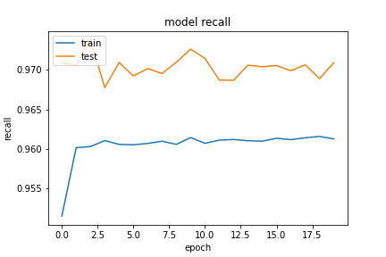
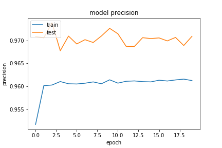


