## network
三層 `BI-LSTM`，神經元分別是，64、32、16，再接神經網路分別是 8 和 3 層，同時間也有使用正歸化方式去約束 `weight`、`bias` 等。

從以下訓練結果來看，`optimizer` 和 `batch_size` 沒有變化，設定如下

- optimizer
    - learning_rate=0.001
    - momentum=0.89
- train
    - batch_size=512

針對不同 `epoch` 分別為 10、20、40 來做比較。發現說 `predict` 出來的結果很相近。`recall` 大致上約在 0.95 而 `Precision` 也是相同。分別拿以下 `loss` 來觀察，抖動很大應該是尚為擬合。

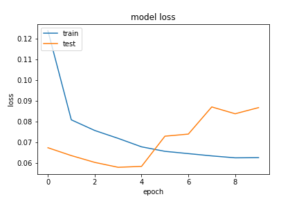
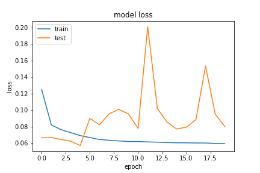
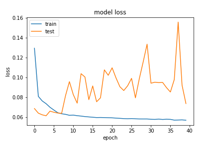

##### 20200915-111015-network-RMSprop

- epochs=10      
- predict
```
TrueNegatives result:  128082.0
TruePositives result:  72690.0
FalseNegatives result:  3072.0
FalsePositives result:  3578.0
Recall result:  0.959452
Precision result:  0.9530865
```
- fig
    - figure/20200915-111015-network-RMSprop

##### 20200915-113013-network-RMSprop
- epochs=20       
- predict
```
TrueNegatives result:  128204.0
TruePositives result:  72579.0
FalseNegatives result:  3183.0
FalsePositives result:  3456.0
Recall result:  0.95798683
Precision result:  0.9545472
```
- fig
    - figure/20200915-113013-network-RMSprop

##### 20200915-114805-network-RMSprop
- epochs=40
- predict
```
TrueNegatives result:  128172.0
TruePositives result:  72715.0
FalseNegatives result:  3047.0
FalsePositives result:  3488.0
Recall result:  0.95978194
Precision result:  0.9542275
```
- fig
    - figure/20200915-114805-network-RMSprop

## network2
兩層 `BI-LSTM`，神經元分別是，32、16，再接神經網路分別是 8 和 3 層，同時間也有使用正歸化方式去約束 `weight`、`bias` 等。

從以下訓練結果來看，`optimizer` 和 `batch_size` 沒有變化，設定如下
- optimizer
    - learning_rate=0.001
    - momentum=0.89
- train
    - batch_size=512

針對不同 `epoch` 分別為 10、20、40 來做比較。發現說 `predict` 出來的結果很相近。`recall` 大致上約在 0.95 而 `Precision` 也是相同，但在 `epoch` 為 20 時約為 0.96。分別拿以下 `loss` 來觀察，抖動很大應該是尚為擬合。

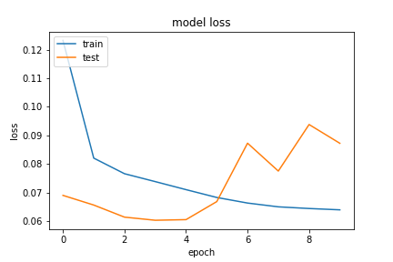
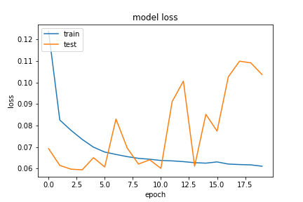
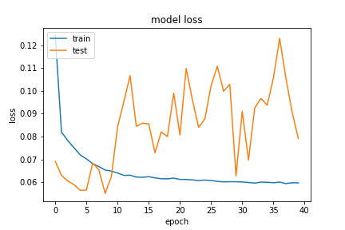


從 `network` 和 `network2` 的架構來看，`network` 多了一層 64 個神經元的 `BI_LSTM` 層，結果是相去不遠的。也就是說疊樂多網路層並非是最好的。

##### 20200915-120725-network2-RMSprop
- epochs=10        
- predict
```
TrueNegatives result:  128022.0
TruePositives result:  72722.0
FalseNegatives result:  3040.0
FalsePositives result:  3638.0
Recall result:  0.95987433
Precision result:  0.95235723
```
- fig
    - figure/20200915-120725-network2-RMSprop

##### 20200915-122026-network2-RMSprop
- epochs=20        
- predict
```
TrueNegatives result:  129010.0
TruePositives result:  72241.0
FalseNegatives result:  3254.0
FalsePositives result:  2917.0
Recall result:  0.9568978
Precision result:  0.96118844
```
- fig
    - figure/20200915-122026-network2-RMSprop


##### 20200915-124032-network2-RMSprop
- epochs=40        
- predict
```
TrueNegatives result:  128550.0
TruePositives result:  72411.0
FalseNegatives result:  3084.0
FalsePositives result:  3377.0
Recall result:  0.9591496
Precision result:  0.9554415
```
- fig
    - figure/20200915-124032-network2-RMSprop

## Network3
兩層 `BI-LSTM`，神經元分別是，32、16，再接神經網路分別是 8 和 3 層，無正規化。

針對不同 `epoch` 分別為 10、20、40 來做比較。發現說 `recall` 在 `epoch` 為 10 時在 0.98，在 `epoch` 為 40 時在 0.97 左右，但 `precision` 也維持在 0.95 左右和前面介紹的神經網路架構沒什麼改變。

同樣的來觀察 `loss`，發現抖動沒先前大，在 `epoch` 為 20 時，以為要擬合了，於是將它調整為 40，但發現並沒有，這讓我傷了一下腦筋，於是又想是不是未擬合，因此在 `network4` 上加了一層 64 個神經元的 `BI-LSTM`。在下面，有嘗試調整 `learning rate`，因為有可能會是局部最小值關係。

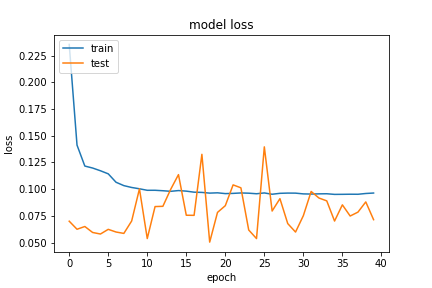
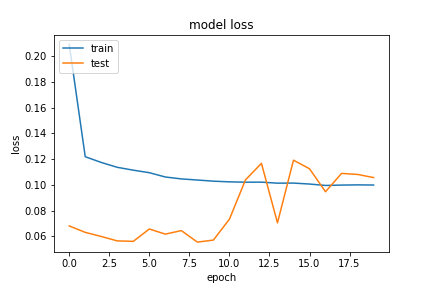
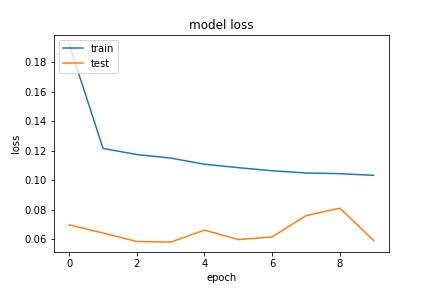
##### 20200915-192326-network3-RMSprop
- epochs=40        
- predict
```
TrueNegatives result:  128504.0
TruePositives result:  73336.0
FalseNegatives result:  1973.0
FalsePositives result:  3609.0
Recall result:  0.97380126
Precision result:  0.9530964
```
- fig
    - figure/20200915-192326-network3-RMSprop

##### 20200915-202658-network3-RMSprop
- epochs=20        
- predict
```
TrueNegatives result:  128801.0
TruePositives result:  71983.0
FalseNegatives result:  3326.0
FalsePositives result:  3312.0
Recall result:  0.9558353
Precision result:  0.956013
```
- fig
    - figure/20200915-202658-network3-RMSprop

##### 20200915-211922-network3-RMSprop
- epochs=10
- predict
```
TrueNegatives result:  128153.0
TruePositives result:  74715.0
FalseNegatives result:  865.0
FalsePositives result:  3689.0
Recall result:  0.9885552
Precision result:  0.9529488
```
- fig
    - figure/20200915-211922-network3-RMSprop
## network3 調整 learning rate

下面分別針對 `epoch` 為 10 和 20 來觀察，發現 `recall` 在 `epoch` 為 10 時 `recall` 高達 0.99，在 40 則有 0.98，但是 `precision` 則是調到 0.94。從下面 `loss` 來看調整 `learning rate` 確實有抑制到抖動。

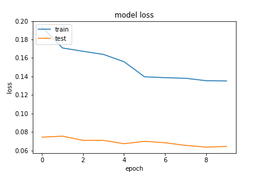
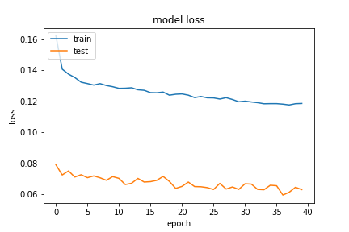

##### 20200915-233149-network3-RMSprop
- learning_rate=0.01
- epochs=10
        
- predict
```
TrueNegatives result:  127085.0
TruePositives result:  75189.0
FalseNegatives result:  391.0
FalsePositives result:  4757.0
Recall result:  0.9948267
Precision result:  0.94049734
```
- fig
    - figure/20200915-233149-network3-RMSprop

##### 20200915-234414-network3-RMSprop

- learning_rate=0.01
- epochs=40
        
- predict
```
TrueNegatives result:  127878.0
TruePositives result:  74657.0
FalseNegatives result:  923.0
FalsePositives result:  3964.0
Recall result:  0.9877878
Precision result:  0.9495809
```
- fig
    - figure/20200915-234414-network3-RMSprop
## Network4
三層 `BI-LSTM`，神經元分別是，64、32、16，再接神經網路分別是 8 和 3 層，無正規化。同樣的 `epoch` 使用 10、20 和 40 觀察。以結果來看 `recall` 大致上約在 0.95 而 `Precision` 也是相同，這和先前一樣。

從以下訓練結果來看，`optimizer` 和 `batch_size` 沒有變化，設定如下

- optimizer
    - learning_rate=0.001
    - momentum=0.89
- train
    - batch_size=512

這邊同樣觀察 `loss`，發現說 `network3` 和 `network4` 在沒正規化下抖動沒很大。但結過還是一樣，不是理想。

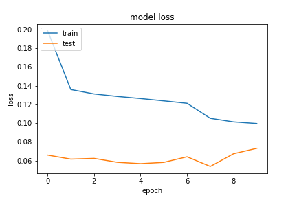
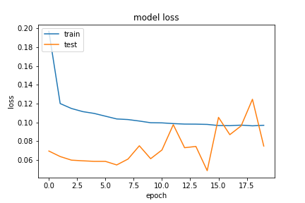
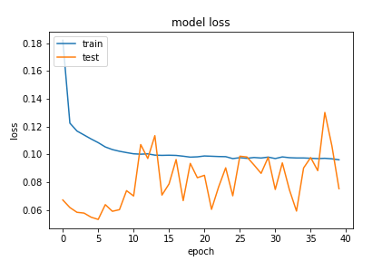

##### 20200915-213526-network4-RMSprop
- epochs=10        
- predict
```
TrueNegatives result:  128340.0
TruePositives result:  72456.0
FalseNegatives result:  3124.0
FalsePositives result:  3502.0
Recall result:  0.9586663
Precision result:  0.95389557
```
- fig
    - figure/20200915-213526-network4-RMSprop


##### 20200915-214749-network4-RMSprop
- epochs=20
- predict
```
TrueNegatives result:  128506.0
TruePositives result:  72435.0
FalseNegatives result:  3145.0
FalsePositives result:  3336.0
Recall result:  0.95838845
Precision result:  0.9559726
```
- fig
    - figure/20200915-214749-network4-RMSprop


##### 20200915-224224-network4-RMSprop
- epochs=40
- predict
```
TrueNegatives result:  128419.0
TruePositives result:  72509.0
FalseNegatives result:  3071.0
FalsePositives result:  3423.0
Recall result:  0.9593676
Precision result:  0.9549202
```
- fig
    - figure/20200915-214749-network4-RMSprop

## network5
這邊使用兩層 `BI-LSTM` 神經元分別為 `32`、`16` 和兩層神經網路分別是 8 和 3，帶有正規化。

從以下訓練結果來看，`optimizer` 和 `batch_size` 沒有變化，設定如下
- optimizer
    - learning_rate=0.01
    - momentum=0.89
- train
    - batch_size=512

`epoch` 同樣以 10、20 和 40 做觀察，發現越高的 `epoch` 讓 `recall` 從 0.98 調到 0.95，但 `precision` 都是保持 0.95。我們觀察 `loss`，相較於先前它更加擬合，但是相對的還不穩定，後續將基於這個架構繼續開發。

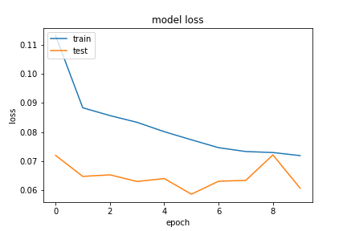
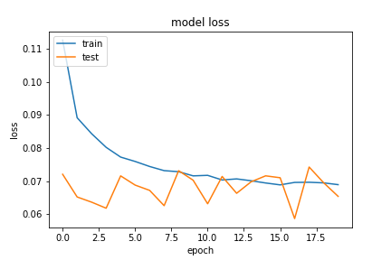
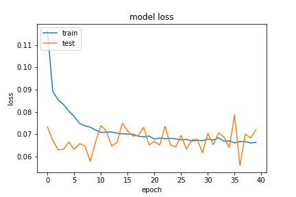

##### 20200916-143949-network5-RMSprop
- epochs=10
        - predict
```
TrueNegatives result:  127750.0
TruePositives result:  74929.0
FalseNegatives result:  852.0
FalsePositives result:  3891.0
Recall result:  0.9887571
Precision result:  0.95063436
```
- fig
    - figure/20200916-143949-network5-RMSprop

##### 20200916-144449-network5-RMSprop
- epochs=20
- predict
```
TrueNegatives result:  127841.0
TruePositives result:  73831.0
FalseNegatives result:  1950.0
FalsePositives result:  3800.0
Recall result:  0.97426796
Precision result:  0.95105046
```
- fig
    - figure/20200916-144449-network5-RMSprop


##### 20200916-145155-network5-RMSprop
- epochs=40
- predict
```
TrueNegatives result:  128344.0
TruePositives result:  72579.0
FalseNegatives result:  3202.0
FalsePositives result:  3297.0
Recall result:  0.9577467
Precision result:  0.9565475
```
- fig
    - figure/20200916-145155-network5-RMSprop

##### 20200916-163718-network6-RMSprop

- epochs=40
- predict
```
TrueNegatives result:  128001.0
TruePositives result:  73529.0
FalseNegatives result:  2047.0
FalsePositives result:  3845.0
Recall result:  0.9729147
Precision result:  0.9503063
```
- fig
    - figure/20200916-163718-network6-RMSprop

##### 20200916-213613-network6-RMSprop
- epochs=60
- predict
```
TrueNegatives result:  127518.0
TruePositives result:  74774.0
FalseNegatives result:  802.0
FalsePositives result:  4328.0
Recall result:  0.98938817
Precision result:  0.94528586
```
- fig
    - figure/20200916-213613-network6-RMSprop